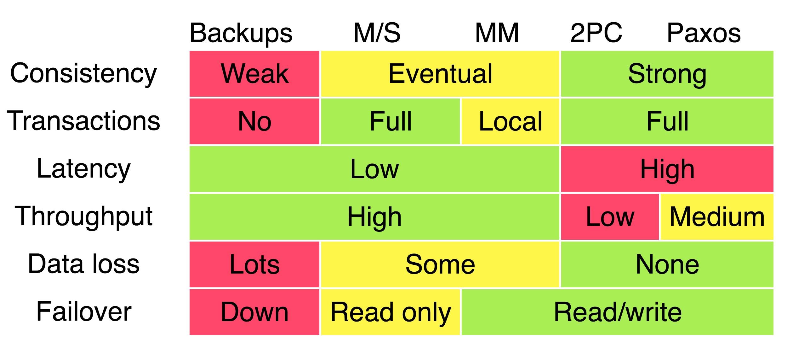

# Consistency intro

The consistency in practice of industry.

## Reference:
- 2PC and 3PC: https://matt33.com/2018/07/08/distribute-system-consistency-protocol/
- 2PC and 3PC difference: https://www.51cto.com/article/784646.html
- Drawbacks of 2-Phase Commit: https://medium.com/geekculture/distributed-transactions-two-phase-commit-c82752d69324