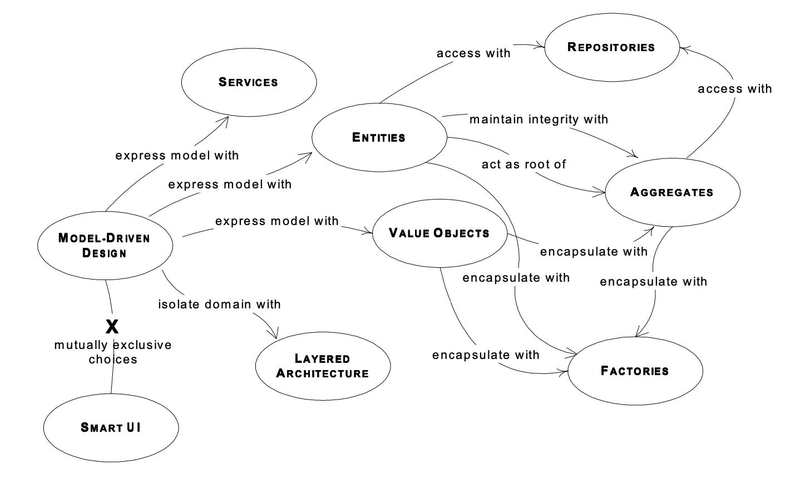
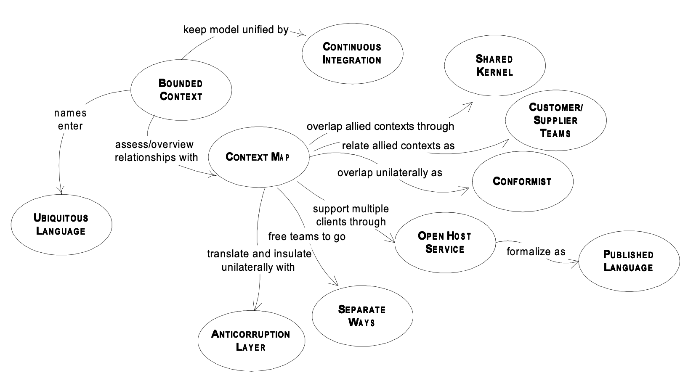

# Domain driven design quickly

## Ubiquitous language

ubiquitous language of a domain
- communicate among different roles
- should be align with implementation

## Concepts

- layered architecture: infra, domain, app, ui
- entity: with id
- value object: no id
- service: support some functions that
	+ not belong to an entity
	+ involve multiple entities
	+ stateless function
- component: decouple from high level
- aggregation: a root of multiple entities and value objects
- factory: create and assemble aggregation root entity
- repository: agent of storage for data accessibility

## Refactor

during project, domain knowledge evolves
- continuous refactoring for mini-step evolution
- key concept change brings big-step evolution

## Model consistency

- bounded context: range of the model should be bounded, not overall
- continuous integration: continuous enrichment within a bounded context
- context mapping: mapping of concepts between bounded contexts
	+ shared kernel: share partial concepts, reduce duplication, but two contexts independent
	+ customer & supplier: one context depends on another, supplier provides API
	+ conformist: client conforms supplier concept, if supplier doesn't provide more help
	+ anticorruption layer: adapter and facade to translate data from external or legacy system
	+ separate ways: for independent apps, no integration
	+ open host service: for multi clients and shared requirements
	+ refine: find core domain and other generic sub-domains, focus on the core domain

