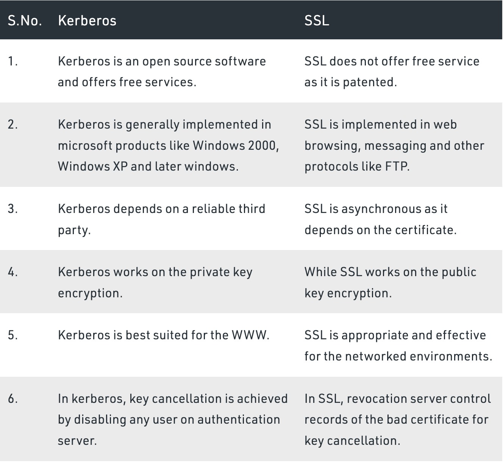

# Authentication (Authn)

安全认证，身份认证
always happens before authz (authorization)

Who are you?

## user authentication
- SFA: single-factor authentication
- 2FA: two-factor authentication
- MFA: multifactor authentication
- OTP: one-time password
- OAuth: open authorization, token-based authentication and authorization

## machine authentication
- TLS: Transport Layer Security (TLS), the successor of the now-deprecated Secure Sockets Layer (SSL)
- Kerberos: is a computer-network authentication protocol that works on the basis of tickets to allow nodes communicating over a non-secure network to prove their identity to one another in a secure manner.

## Reference
- authn: https://www.techtarget.com/searchsecurity/definition/authentication
- TLS: https://en.wikipedia.org/wiki/Transport_Layer_Security
- kerberos: https://en.wikipedia.org/wiki/Kerberos_(protocol)
- difference between kerberos and SSL: https://www.geeksforgeeks.org/difference-between-kerberos-and-ssl/