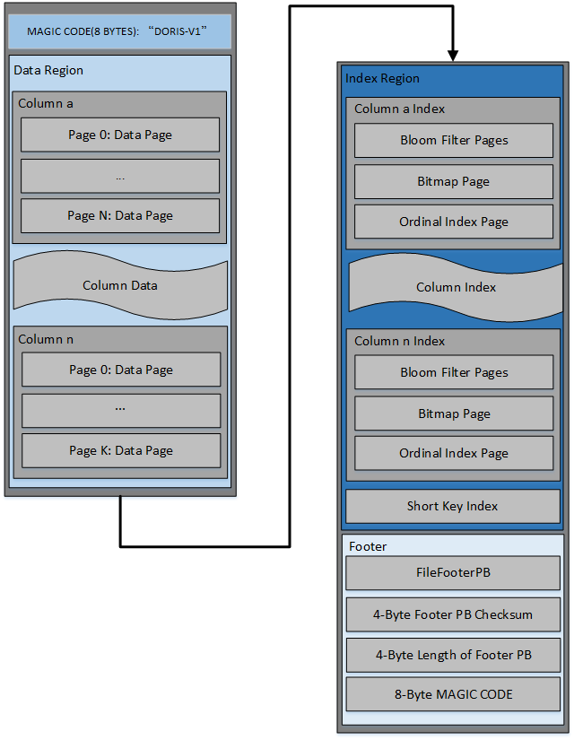
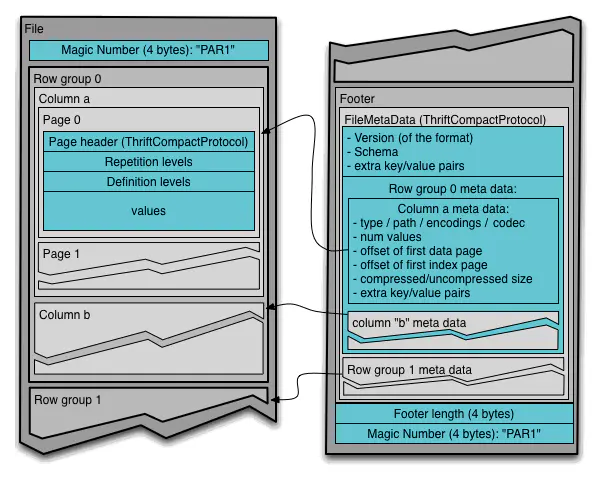
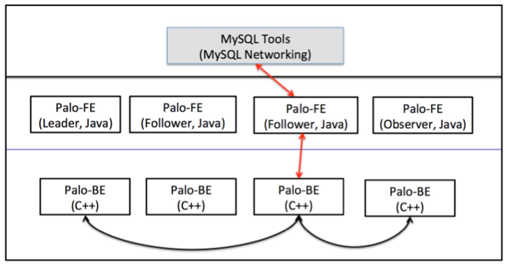
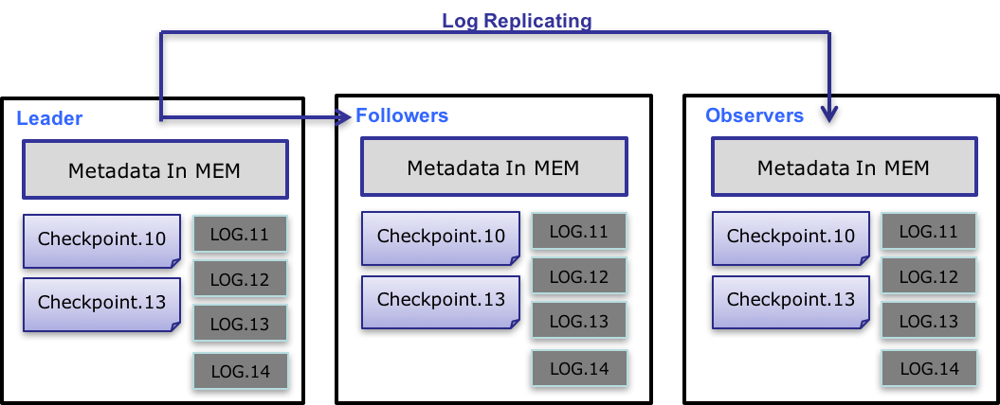

# Doris Learning

A fast MPP (Massively Parallel Processing) **database** for all modern analytics on big data.

## Deploy

**发布方式**: code release, so need user compile

**关闭Swap功能**: [linux_swap](https://www.jianshu.com/p/a2d2f284fc0a)

## Role

- Frontend (FE): FE 的磁盘空间主要用于存储元数据，包括日志和 image。通常从几百 MB 到几个 GB 不等。
- Backend (BE): BE 的磁盘空间主要用于存放用户数据，总磁盘空间按用户总数据量 * 3（3副本）计算，然后再预留额外 40% 的空间用作后台 compaction 以及一些中间数据的存放。
- Broker: Broker 是用于访问外部数据源（如 hdfs）的进程。通常，在每台机器上部署一个 broker 实例即可。

> FE 分为 Leader，Follower 和 Observer 三种角色。 默认一个集群，只能有一个 Leader，可以有多个 Follower 和 Observer。其中 Leader 和 Follower 组成一个 Paxos 选择组，如果 Leader 宕机，则剩下的 Follower 会自动选出新的 Leader，保证写入高可用。Observer 同步 Leader 的数据，但是不参加选举。如果只部署一个 FE，则 FE 默认就是 Leader。
> 
> 第一个启动的 FE 自动成为 Leader。在此基础上，可以添加若干 Follower 和 Observer。
>> 
> Follower FE（包括 Leader）的数量必须为奇数，建议最多部署 3 个组成高可用（HA）模式即可。
> 当 FE 处于高可用部署时（1个 Leader，2个 Follower），我们建议通过增加 Observer FE 来扩展 FE 的读服务能力。当然也可以继续增加 Follower FE，但几乎是不必要的。

> BE 节点的扩容和缩容过程，不影响当前系统运行以及正在执行的任务，并且不会影响当前系统的性能。数据均衡会自动进行。

> Broker 是无状态的进程，可以随意启停。当然，停止后，正在其上运行的作业会失败，重试即可。

## Design

### Data structure

Doris

Parquet

Differences
- no RowGroup in Doris
- no index in Parquet (column index feature supported from [version 2.5](https://stackoverflow.com/questions/26909543/index-in-parquet))

Some points
- bloom filter: for existence
- bitmap: for null value
- ordinal index: 稀疏索引
- short key index

### SQL features
- Rollup: [Rollup](http://doris.apache.org/master/zh-CN/getting-started/data-model-rollup.html#rollup), [View](http://doris.apache.org/master/zh-CN/getting-started/hit-the-rollup.html)
- Cube: similar to rollup, but more complicated, more dimensions

### High-level & Metadata design
[link](https://doris.apache.org/master/zh-CN/internal/metadata-design.html#%E5%90%8D%E8%AF%8D%E8%A7%A3%E9%87%8A)

如上图，Doris 的整体架构分为两层。多个 FE 组成第一层，提供 FE 的横向扩展和高可用。多个 BE 组成第二层，负责数据存储与管理。
1. FE 节点分为 follower 和 observer 两类。各个 FE 之间，通过 bdbje（BerkeleyDB Java Edition）进行 leader 选举，数据同步等工作。
2. follower 节点通过选举，其中一个 follower 成为 leader 节点，负责元数据的写入操作。当 leader 节点宕机后，其他 follower 节点会重新选举出一个 leader，保证服务的高可用。
3. observer 节点仅从 leader 节点进行元数据同步，不参与选举。可以横向扩展以提供元数据的读服务的扩展性。

Doris 的元数据是全内存的。每个 FE 内存中，都维护一个完整的元数据镜像。在百度内部，一个包含2500张表，100万个分片（300万副本）的集群，元数据在内存中仅占用约 2GB。
(seems like metadata is the state of the FE cluster in memory, so the memory size determines the metadata size)

Doris 的元数据主要存储4类数据：
- 用户数据信息。包括数据库、表的 Schema、分片信息等。
- 各类作业信息。如导入作业，Clone 作业、SchemaChange 作业等。
- 用户及权限信息。
- 集群及节点信息。

state build 过程也是需要log，snapshot，state in mem之类的东西。
