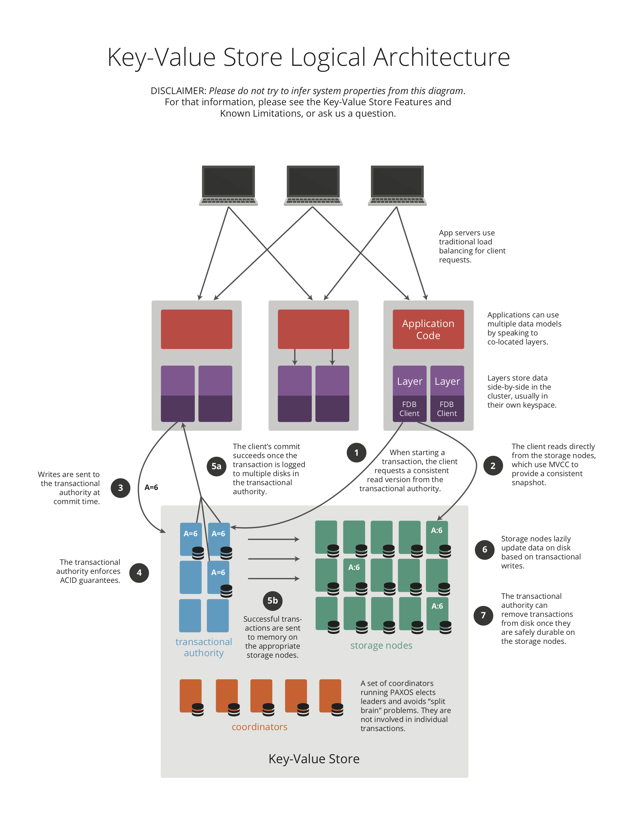
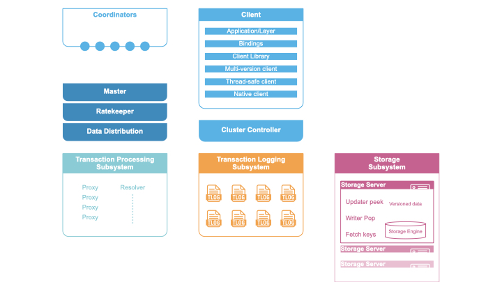
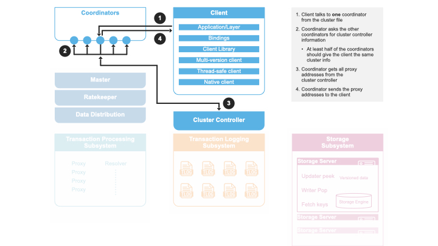
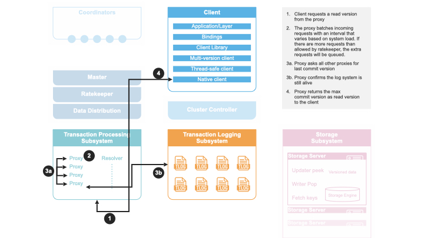
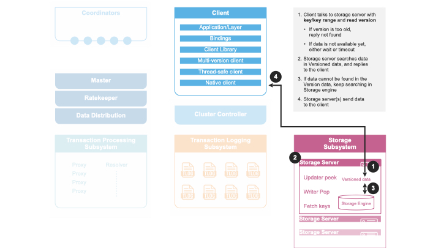
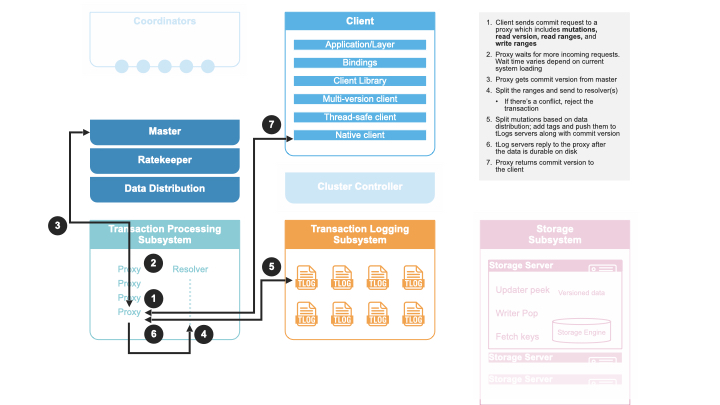
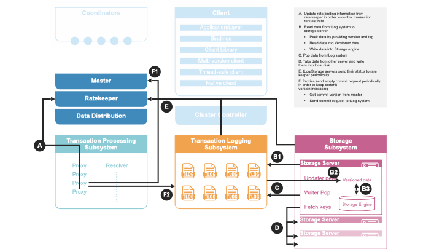

# FoundationDB

## Architecture

### Components

### Workflow
Step 1, client get proxy addr

Step 2, client read commit version

Step 3, client read data

Step 4, client commit txn

Background periodic threads

## Reference
- architecture: https://apple.github.io/foundationdb/architecture.html