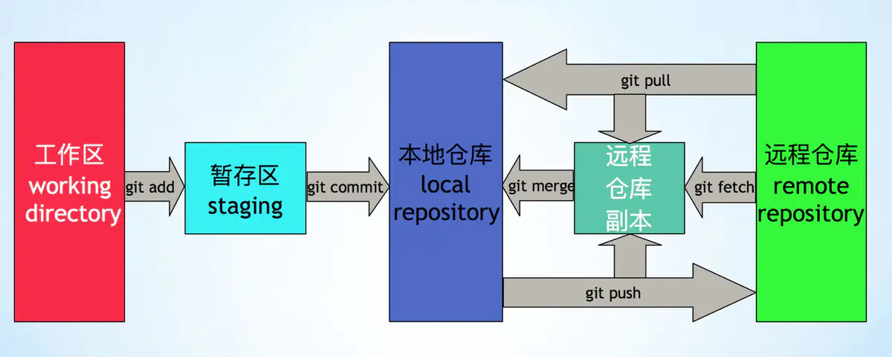

# Git Learning

Git is a Distributed Version Control System (DVCS), differenct from Centralized version control system (CVCS) like SVN.

## Terminology
- blob (binary large object)
- tree
- index
- commit
- branch
- tag

## Design
Distributed repo, no monotonic version

- working area
- staging area
- local repo
- remote repo cache
- remote repo

### Three-tree Arch
- repository
- staging index
- working directory

### Concepts
- `.git` is the folder where git stores all its data, fork from a remote repo just download the `.git` folder to local
- `.git/objects` stores all the real contents, including object types like:
    + blob
    + tree (with sub-tree)
- staging index is a place where trees are assembled, stored in `.git/index`
 file, we can read this file by command `git ls-files -s`
- `git status` makes two comparations:
    + it compares the index file with the current working directory — changes are reported as Changes not staged for commit
    + it compares the index file with the HEAD commit — changes are reported as Changes to be committed
- commit is a wrapper around a tree object that:
    + allows attaching a message to a tree (group of files)
    + allows specifying a parent (commit)
- git history is a chain of commits
- HEAD is a reference to the checked out commit, which stored in `.git/HEAD` file
- all the git references are stored in `.git/refs`, the referece types include:
    + branch
    + tag
    + remote
- branch is a text file pointing to a commit, part of reference, which stored in `.git/refs/heads` directory
- tag is a text file pointing to a commit, part of reference, which stored in `.git/refs/tags` directory
- branch and tag are essentially the same, as they are both the reference of a commit. To my understanding, the concepts of branch and tag are different, branch is like a line of history commits, but tag is a point or milestone of a branch. However, in git, they are implemented in the same way, as the reference of a commit, so they can both be checked out to, and route to the parent commits. I think we should keep the nature of the reference in mind, and use the concept in development.

## Reference
- https://www.designveloper.com/blog/git-concepts-architecture/
- http://git-scm.com/book/zh/v2
- https://www.jianshu.com/p/c18e472fbf19
- https://indepth.dev/posts/1168/becoming-a-git-pro-part-1-internal-git-architecture
- https://medium.com/sysf/become-a-git-pro-in-just-one-blog-a-thorough-guide-to-git-architecture-and-command-line-interface-93fbe9bdb395
- https://www.tutorialspoint.com/git/git_basic_concepts.htm