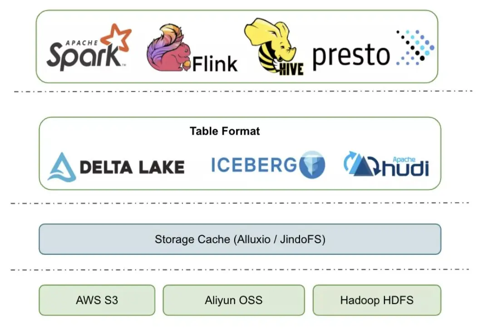
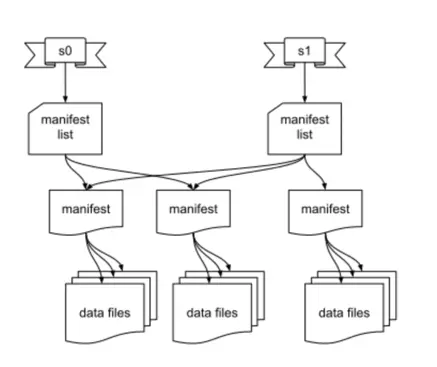
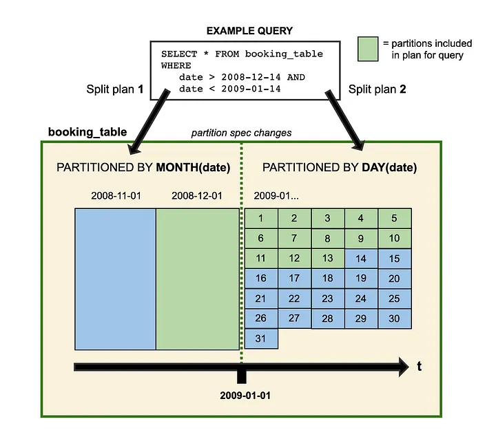

# Apache Iceberg

Apache Iceberg is an open table format for huge analytic datasets. Iceberg adds tables to compute engines including Spark, Trino, PrestoDB, Flink, Hive and Impala using a high-performance table format that works just like a SQL table.

Iceberg works as a layer between calculation and storage layers, it helps define and manage the metadata of huge tables, but the storage data file can still be like parquet, ORC.

Essentially, it is a table management layer, based on the data storage layer.



## Table format



- Snapshot metadata file: contains metadata about the table like the table schema, the partition specification as well as a path to the manifest list.
- Manifest list: contains an entry for each manifest file associated with the snapshot. Each entry includes a path to the manifest file and some metadata about the file, including partition stats and data file counts. These stats can be used to avoid reading manifests that aren’t required for an operation.
- Manifest file: contains a list of paths to related data files. Each entry for a data file includes some metadata about the file, such as per-column upper and lower bounds which can be used to prune files during query planning.
- Data file: the physical data file, written in formats like Parquet, ORC, Avro etc.

## Schema evolution
table schema can be managed by configured back-end, like JDBC, Hive metastore, etc.

the schema evolution is easy because all the change only updates the metadata, no data rewrite is needed. including: 
- schema evolution
- partition evolution
- sort order evolution

Iceberg uses unique IDs to track each column in a table. When you add a column, it is assigned a new ID so existing data is never used by mistake.

These safe schema evolutions can be supported:
```
#Add columns
table.updateSchema()
     .addColumn("hotel_geo_id", Types.LongType.get())
     .commit();
#Delete columns
table.updateSchema()
     .deleteColumn("hotel_name")
     .commit();
#Rename columns
table.updateSchema()
     .renameColumn("arrival_date", "check_in_date")
     .commit();
#Promote int -> long
table.updateSchema()
     .updateColumn("price", Types.LongType.get())
     .commit();
#Promote float -> double
table.updateSchema()
     .updateColumn("float", Types.DoubleType.get())
     .commit();
#Widen decimal precision
table.updateSchema()
     .updateColumn("decimal", Types.DecimalType.of(4, 2))
     .commit();
#Rearrange columns
table.updateSchema()
     .moveAfter("customer_id", "hotel_id")
     .moveBefore("hotel_name", "hotel_id")
     .commit();
```

## Partitioning
Other tables formats like Hive support *partitioning*, but Iceberg supports **hidden partitioning**.

Iceberg produces partition values by taking a column value and optionally transforming it. Iceberg is responsible for converting `event_time` into `event_date`, and keeps track of the relationship.

[supported partition transforms](https://iceberg.apache.org/spec/#partition-transforms)



## Maintenance
Each write to an Iceberg table creates a new snapshot, or version, of a table. Snapshots can be used for time-travel queries, or the table can be rolled back to any valid snapshot.

### Expire snapshots
Snapshots accumulate until they are expired by the `expireSnapshots` operation. Regularly expiring snapshots is recommended to delete data files that are no longer needed, and to keep the size of table metadata small.

Expiring old snapshots removes them from metadata, so they are no longer available for time travel queries.

Data files are not deleted until they are no longer referenced by a snapshot that may be used for time travel or rollback. Regularly expiring snapshots deletes unused data files.

### Remove old metadata files
Iceberg keeps track of table metadata using JSON files. Each change to a table produces a new metadata file to provide atomicity.
It means any submit of a table can create a new metadata file, e.g. an insert of a row.

Old metadata files are kept for history by default. Tables with frequent commits, like those written by streaming jobs, may need to regularly clean metadata files. [reference config](https://iceberg.apache.org/docs/latest/maintenance/#remove-old-metadata-files)

### Delete orphan files
In Spark and other distributed processing engines, task or job failures can leave files that are not referenced by table metadata, and in some cases normal snapshot expiration may not be able to determine a file is no longer needed and delete it.

To clean up these “orphan” files under a table location, use the `deleteOrphanFiles` action.

### Compact data files
Some tables require additional maintenance. For example, streaming queries may produce small data files that should be compacted into larger files. And some tables can benefit from rewriting manifest files to make locating data for queries much faster.

Iceberg can compact data files in parallel using Spark with the `rewriteDataFiles` action. This will combine small files into larger files to reduce metadata overhead and runtime file open cost.

### Rewrite manifests
Iceberg uses metadata in its manifest list and manifest files speed up query planning and to prune unnecessary data files. The metadata tree functions as an index over a table’s data.

When a table’s write pattern doesn’t align with the query pattern, metadata can be rewritten to re-group data files into manifests using `rewriteManifests` or the `rewriteManifests` action (for parallel rewrites using Spark).

It means that the Icegerg table maintains only one order of manifests in metadata, serve only one index for reading.

## Performance

### Scan planning
Scan planning is the process of finding the files in a table that are needed for a query.

### Metadata filtering
ceberg uses two levels of metadata to track the files in a snapshot.
- Manifest files store a list of data files, along each data file’s partition data and column-level stats
- A manifest list stores the snapshot’s list of manifests, along with the range of values for each partition field

For fast scan planning, Iceberg first filters manifests using the partition value ranges in the manifest list. Then, it reads each manifest to get data files. With this scheme, the manifest list acts as an index over the manifest files, making it possible to plan without reading all manifests.

In addition to partition value ranges, a manifest list also stores the number of files added or deleted in a manifest to speed up operations like snapshot expiration.

### Data filtering
Manifest files include a tuple of partition data and column-level stats for each data file.

During planning, query predicates are automatically converted to predicates on the partition data and applied first to filter data files. Next, column-level value counts, null counts, lower bounds, and upper bounds are used to eliminate files that cannot match the query predicate.

## Reliability & Correctness
Iceberg was designed to solve correctness problems that affect Hive tables running in S3.

Hive tables track data files using both a central metastore for partitions and a file system for individual files. This makes atomic changes to a table’s contents impossible, and eventually consistent stores like S3 may return incorrect results due to the use of listing files to reconstruct the state of a table. It also requires job planning to make many slow listing calls: O(n) with the number of partitions.

Iceberg tracks the complete list of data files in each snapshot using a persistent tree structure. Every write or delete produces a new snapshot that reuses as much of the previous snapshot’s metadata tree as possible to avoid high write volumes.

Valid snapshots in an Iceberg table are stored in the table metadata file, along with a reference to the current snapshot. Commits replace the path of the current table metadata file using an atomic operation. This ensures that all updates to table data and metadata are atomic, and is the basis for **serializable isolation**.

### Concurrent write operations
Iceberg supports multiple concurrent writes using optimistic concurrency.

Each writer assumes that no other writers are operating and writes out new table metadata for an operation. Then, the writer attempts to commit by atomically swapping the new table metadata file for the existing metadata file.

If the atomic swap fails because another writer has committed, the failed writer retries by writing a new metadata tree based on the the new current table state.

Commits are structured as assumptions and actions. After a conflict, a writer checks that the assumptions are met by the current table state.

### Compatibility
By avoiding file listing and rename operations, Iceberg tables are compatible with any object store. No consistent listing is required.

## Schemas
Iceberg tables support these [data types](https://iceberg.apache.org/docs/latest/schemas/).


## References
- official doc: https://iceberg.apache.org/docs/latest/
- brief intro: https://www.jianshu.com/p/c202569008a7
- A Short Introduction to Apache Iceberg: https://medium.com/expedia-group-tech/a-short-introduction-to-apache-iceberg-d34f628b6799