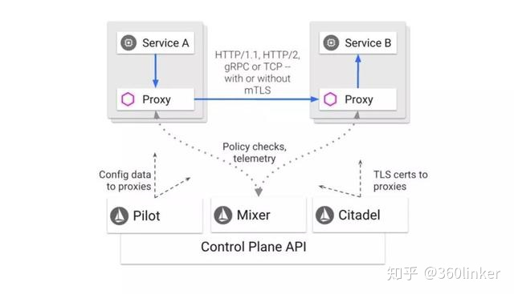

# ISTIO Learning

An open platform to connect, secure, control and observe services.

## Concept
- 连接（Connect）：智能控制服务之间的调用流量，能够实现灰度升级、AB 测试和红黑部署等功能
- 安全加固（Secure）：自动为服务之间的调用提供认证、授权和加密。
- 控制（Control）：应用用户定义的 policy，保证资源在消费者中公平分配。
- 观察（Observe）：查看服务运行期间的各种数据，比如日志、监控和 tracing，了解服务的运行情况。

## Service Mesh

### Network Proxy 网络代理

**分类**
> - 正向代理(Proxy): 代理客户端, like proxy to visit google
> - 反向代理(Reverse Proxy): 代理服务器, like load balancer; Nginx是性能非常好的反向代理服务器，用来做LB

**作用**
> - 拦截：代理可以选择性拦截传输的网络流量，比如一些公司限制员工在上班的时候不能访问某些游戏或者电商网站，再比如把我们和世界隔离开来的 GFW，还有在数据中心中拒绝恶意访问的网关。
> - 统计：既然所有的流量都经过代理，那么代理也可以用来统计网络中的数据信息，比如了解哪些人在访问哪些网站，通信的应答延迟等。
> - 缓存：如果通信双方比较”远“，访问比较慢，那么代理可以把最近访问的数据缓存在本地，后面的访问不用访问后端来做到加速。CDN 就是这个功能的典型场景。
> - 分发：如果某个通信方有多个服务器后端，代理可以根据某些规则来选择如何把流量发送给多个服务器，也就是我们常说的负载均衡功能，比如著名的 Nginx 软件。
> - 跳板：如果 A、B 双方因为某些原因不能直接访问，而代理可以和双方通信，那么通过代理，双方可以绕过原来的限制进行通信。这应该是广大中国网民比较熟悉的场景。
> - 注入：既然代理可以看到流量，那么它也可以修改网络流量，可以自动在收到的流量中添加一些数据，比如有些宽带提供商的弹窗广告。

Service Mesh is like a distributed proxy deployment.  
> 在传统模式下，代理一般是集中式的单独的服务器，所有的请求都要先通过代理，然后再流入转发到实际的后端。
> 
> 而在 Service Mesh 中，代理变成了分布式的，它常驻在了应用的身边（最常见的就是 Kubernetes Sidecar 模式，每一个应用的 Pod 中都运行着一个代理，负责流量相关的事情）。
> 
> 此外，原来的代理都是基于网络流量的，一般都是工作在 IP 或者 TCP 层，很少关心具体的应用逻辑。
> 
> 但是 Service Mesh 中，代理会知道整个集群的所有应用信息，并且额外添加了热更新、注入服务发现、降级熔断、认证授权、超时重试、日志监控等功能，让这些通用的功能不必每个应用都自己实现，放在代理中即可。
> 
> 换句话说，Service Mesh 中的代理对微服务中的应用做了定制化的改进！

Controller of Service Mesh to manage all the proxy nodes.

## Arch

Istio is like an implementation of Service Mesh.

> 可以看到，Istio 就是我们上述提到的 Service Mesh 架构的一种实现，服务之间的通信（比如这里的 Service A 访问 Service B）会通过代理（默认是 Envoy）来进行。
> 
> 而且中间的网络协议支持 HTTP/1.1，HTTP/2，gRPC 或者 TCP，可以说覆盖了主流的通信协议。
> 
> 控制中心做了进一步的细分，分成了 Pilot、Mixer 和 Citadel，它们的各自功能如下：
> 
> - Pilot：为 Envoy 提供了服务发现，流量管理和智能路由（AB 测试、金丝雀发布等），以及错误处理（超时、重试、熔断）功能。 用户通过 Pilot 的 API 管理网络相关的资源对象，Pilot 会根据用户的配置和服务的信息把网络流量管理变成 Envoy 能识别的格式分发到各个 Sidecar 代理中。
> - Mixer：为整个集群执行访问控制（哪些用户可以访问哪些服务）和 Policy 管理（Rate Limit，Quota 等），并且收集代理观察到的服务之间的流量统计数据。
> - Citadel：为服务之间提供认证和证书管理，可以让服务自动升级成 TLS 协议。
> 
> 代理会和控制中心通信，一方面可以获取需要的服务之间的信息，另一方面也可以汇报服务调用的 Metrics 数据。

知道了 Istio 的核心架构，再来看看它的功能描述就非常容易理解了：
> - 连接：控制中心可以从集群中获取所有服务的信息，并分发给代理，这样代理就能根据用户的期望来完成服务之间的通信（自动地服务发现、负载均衡、流量控制等）。
> - 安全加固：因为所有的流量都是通过代理的，那么代理接收到不加密的网络流量之后，可以自动做一次封装，把它升级成安全的加密流量。
> - 控制：用户可以配置各种规则（比如 RBAC 授权、白名单、Rate Limit 或者 Quota 等），当代理发现服务之间的访问不符合这些规则，就直接拒绝掉。
> - 观察：所有的流量都经过代理，因此代理对整个集群的访问情况知道得一清二楚，它把这些数据上报到控制中心，那么管理员就能观察到整个集群的流量情况了

## Conclusion & Inspiration

> - 数据中心要管理的节点越来越多，我们需要把任务执行分布到各节点（Agent 负责的功能）。
> - 同时也需要对整个集群进行管理和控制（Control Plane 的功能），完全去中心化的架构是无法满足后面这个要求的。

## References
- official site: https://istio.io/
- github repo: https://github.com/istio/istio
- introduction: https://zhuanlan.zhihu.com/p/65208782
- practice: https://mediumcn.com/categories#istio