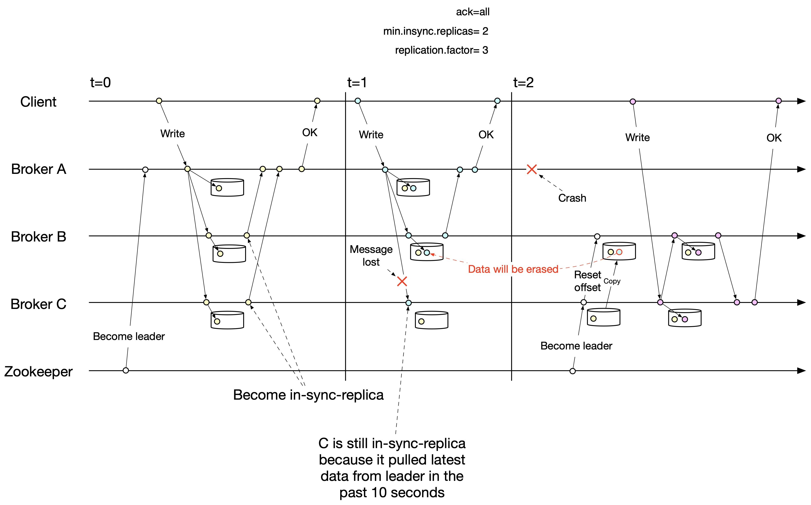

# Kafka Learning

## Arch

## Usage

### Producer

Configurations important for producer:
```
acks
retries
max.in.flight.requests.per.connection
delivery.timeout.ms
request.timeout.ms
linger.ms
batch.size
receive.buffer.bytes
send.buffer.bytes
enable.idempotence
```

### Consumer

Configurations important for consumer:
```
fetch.min.bytes
fetch.max.bytes
heartbeat.interval.ms
session.timeout.ms (depends on group.min.session.timeout.ms & group.max.session.timeout.ms in broker config)
auto.offset.reset
enable.auto.commit
auto.commit.interval.ms
max.poll.interval.ms
max.poll.records
receive.buffer.bytes
request.timeout.ms

```

- for long time process, consumer can `pause` the partitionSet and `resume` after process finish, to avoid the broker rebalance

### Data Loss

保证数据不丢，需要做到at least once，再加上处理数据的幂等性，就可以在生产环境中获得exact once的效果。

#### ISR
ISR条件: 
- 副本所在节点必须维持着与zookeeper的连接
- 副本最后一条消息的offset与leader副本的最后一条消息的offset之间的差值不能超过指定的阈值replica.lag.time.max.ms。如果该follower在此时间间隔内一直没有追上过leader的所有消息，则该follower就会被剔除isr列表

follower把leader的LEO之前的日志全部同步完成时，则认为follower副本已经追赶上了leader，这个时候会更新这个副本的lastCaughtUpTimeMs标识，kafka副本管理器会启动一个副本过期检查的定时任务，这个任务会定期检查当前时间与副本的lastCaughtUpTimeMs的差值是否大于参数`replica.lag.time.max.ms`的值，如果大于，则会把这个副本踢出ISR集合

所以ISR的insync代表的意思是，上次caught up的时候跟leader的gap是0

#### Broker
- min.insync.replicas (一般是N/2+1)
- no sync flush to disk, essentially async flush
- only provide flush config by msg or time, but not recommended

只要min.insync.replicas小于N，都可能在理论上存在丢数据的可能，因为partition选leader的策略是从insync list里随机挑一个，而insync list的更新频率默认是10s，所以在这个time gap里落后的follower有可能会被选成leader，这样就丢了一段数据。这种配置也是生产环境下会用的，所以这种丢数据的可能性是存在的。(这段话是错误的，参见后面的Bad Sample)

如果把min.insync.replicas设置成等于N，理论上来说不会丢数据了，但是结合数据刷盘的实现方式，也是有可能丢数据的。  
leader先落盘，follower从leader的disk同步数据，但是follower因为异步刷盘，所以会在写入pagecache但是未刷盘的情况下ack，于是producer收到所有node的ack(如果配置ack=all)认为发送成功，但是这时leader node down，两个follower都没刷盘，同时断电，pagecache丢失。再重启之后，leader没起来，只有两个follower，会成功选出新leader，但是新写的数据就丢了。  
这个情况是非常极端的，只是理论场景，我们也不需要expect它会出现。从kafka的设计哲学来看，是expect从replica恢复数据来保证一致性，而不是从硬盘恢复数据，这样的设计哲学提供的可靠度也是够的，而且performance会更好。

从这一点来看，相对于kafka的落盘策略，raft就安全得多，每次集群sync都是刷盘操作，并且刷盘成功才会ack。对于业务层，只要做到response是在刷盘后，或者是通过读硬盘上的raft log来repsonse，就可以实现强一致性，response success的数据一定在多数node的硬盘上存在。

#### Producer
- ack = all
- sync send or wait for callback, fail then retry
- retries

前两点保证发送数据不丢，一般也会加上第三点来做自动重试。  
`ack = all` means all the replicas of insync list都ack才算成功，比如`min.insync.replicas`为2，但是insync list如果是3，也要等到3个副本都ack才算成功。

#### Consumer
- no auto commit
- commit after process done

消费者不丢数据比较容易做到，前提是消费者处理数据需要幂等性，这样可以安全的重复消费。

#### Bad Sample



这个例子有个陷阱，是错误的。

t=1时C是在insync list，所以如果消息没到C，是不能成功返回的，因为ack=all。如果这时能成功返回，那么说明C已经不在insync list了，到t=2时C也不能成为leader了。

理论上来说，有一种可能可以让这个例子解释得通，就是t=1时C不在insync list，而t=2时C进入了insync list。而按照ISR的条件来看，如果C要进入insync list，那么就一定会在t=1与t=2之间的某个时刻追上了leader的LEO，这个LEO又一定会包含t=1时写入的数据点，那么C就不会丢掉这个数据。所以这个例子是不会造成数据丢失的。

#### More Analysis
- HW (High Watermark)
- LEO (Log End Offset)
- leader epoch (pair of epoch and offset)

根据reference文档里的分析，kafka在早期的版本有data loss的风险，是因为HW和LEO的更新（leader与follower分别的更新）需要两轮follower发起的fetch请求来完成，所以会导致follower的HW值过时，这样如果leader下台换主，会根据新leader的过时的HW来截断log，造成数据丢失。

在0.11.0.0的kafka里引入了leader epoch来取代HW值，来判断数据是否需要截断，这样就可以避免上面的数据丢失的情况。

目前看来，kafka最可能出现丢数据的case应该是跟它只支持异步刷盘有关，也就是前面Broker部分提到的极端情况下的case，分析也如上。

总的来说，通过想方设法找data loss的case而不得的过程，说明kafka的设计还是很靠谱的，值得学习和借鉴。

## Reference
- https://kafka.apache.org/documentation/
- https://blog.csdn.net/wang2963973852/article/details/103211380
- https://www.cnblogs.com/huxi2b/p/7453543.html
- https://blog.csdn.net/lbh199466/article/details/89918251
- https://stackoverflow.com/questions/50689177/kafka-ack-all-and-min-isr
- https://www.jianshu.com/p/fd50befccfdd
