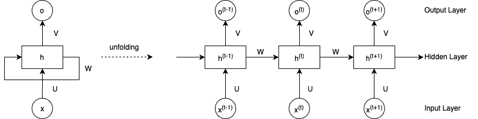
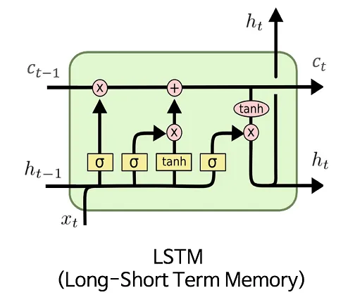
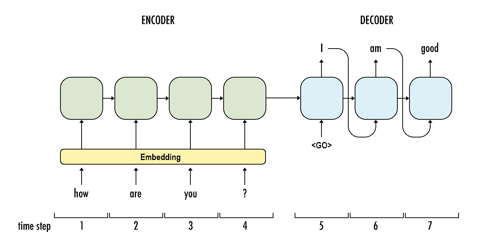
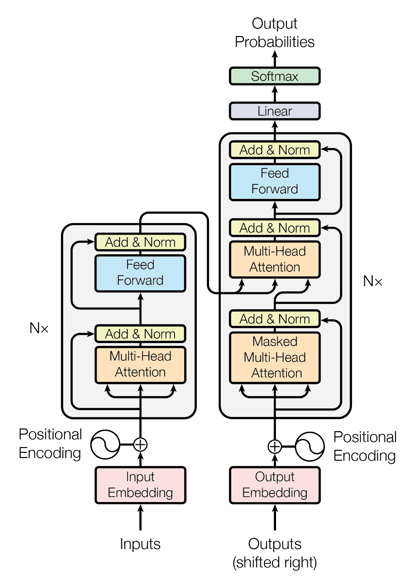

# RNN & Transformer

## Terminologies

- NLP: natural language processing
- RNN: Recurrent Neural Networks
- LSTM: Long Short-Term Memory

## What is RNN

RNNs are particularly effective in capturing short-term dependencies in sequences. However, they suffer from the vanishing gradient problem, where the influence of earlier inputs diminishes exponentially as the sequence progresses, making it difficult to capture long-term dependencies.

LSTM is a specific type of RNN architecture that addresses the vanishing gradient problem, which occurs when training deep neural networks. LSTMs leverage memory cells and gates to selectively store and retrieve information over long sequences, making them effective for capturing long-term dependencies.

## Encoder & decoder

Sequence-to-Sequence Model, aka. encoder-decoder model

Despite being a useful model for summarising the input sequence, the sequence-to-sequence model has an issue when the input sequence is quite long and contains a lot of information.

Therefore, people have started using Transformer, which applies a special attention mechanism. Transformer is a state-of-the-art model that is widely used in NLP and Computer Vision.

## Transformer

Unlike RNNs, Transformers do not rely on recurrence but instead operate on self-attention.

There are many types of Transformers. Two influential models have emerged in the field of NLP: BERT (Bidirectional Encoder Representations from Transformers) and GPT (Generative Pre-trained Transformer).

BERT applies the encoder of the Transformer. Similar to the Transformer, GPT consists of both an encoder and a decoder. 

### with attention

1. the encoder passes a lot more data to the decoder. Instead of passing the last hidden state of the encoding stage, the encoder passes all the hidden states to the decoder
2. an attention decoder does an extra step before producing its output. In order to focus on the parts of the input that are relevant to this decoding time step, the decoder does the following:
	a. Look at the set of encoder hidden states it received – each encoder hidden state is most associated with a certain word in the input sentence
	b. Give each hidden state a score (let’s ignore how the scoring is done for now)
	c. Multiply each hidden state by its softmaxed score, thus amplifying hidden states with high scores, and drowning out hidden states with low scores

## Difference Between RNNs and Transformers

Transformers have proven to be a viable alternative due to their parallel processing capability, ability to capture long-range dependencies, and improved hardware utilization.

RNNs still hold value when dealing with tasks where temporal dependencies play a critical role.

## References

- from RNN to transformer: https://www.baeldung.com/cs/rnns-transformers-nlp
- visualizing neural machine transition model: https://jalammar.github.io/visualizing-neural-machine-translation-mechanics-of-seq2seq-models-with-attention/
- friendly intro of RNN: https://www.youtube.com/watch?v=UNmqTiOnRfg
- word2vec: https://p.migdal.pl/blog/2017/01/king-man-woman-queen-why