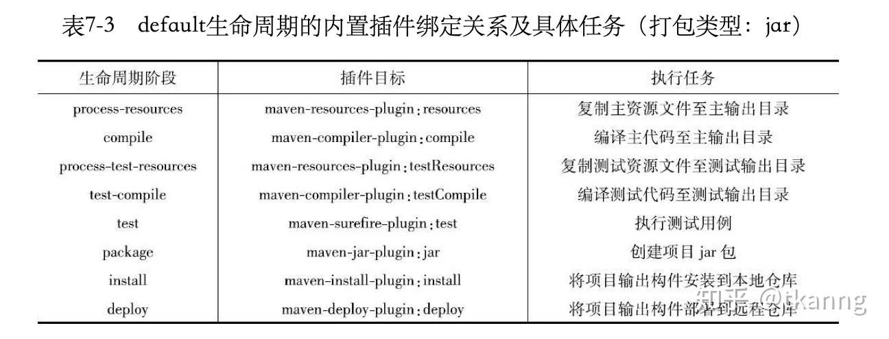

# Maven Learning

- Maven是声明式项目管理工具，通过`pom.xml`文件来声明和构建依赖关系
- Make和Ant是过程式项目管理工具，通过用户编写构建脚本来组织依赖关系

## Concepts
- Super POM: Super POM 是 Maven 的默认 POM。除显式声明以外，所有的POM都继承自Super POM
- Project Inheritance: 继承已有pom.xml，便于做公共配置管理
- Project Aggregation: 同一项目中存在多个module
- Lifecycle: Maven的生命周期就是为了对所有的构建过程进行抽象和统一
- Phase: 构成生命周期的一个步骤
- Plugin: 一个 Plugin 包含多个goal，来完成项目构建的实际工作
- Dependency: 项目的依赖关系

## Lifecycles & Phases


- default (build): 编译源代码并处理打包项目相关的所有事情
- clean: 清理构建输出，包括生成的编译类、JAR文件等
- site: 为项目生成文档

### Default
default生命周期定义了真正构建时所需要执行的所有步骤，它是所有生命周期中最核心的部分，其包含的阶段如下：

- validate：验证项目是否合法以及项目构建信息是否完备。
- initialize：初始化。
- generate-sources: 生成源代码，如：ANTLR 插件会根据语法文件生成对应的 Java 源代码。
- process-sources: 处理项目主资源文件。一般来说，是对src/main/resources目录的内容进行变量替换等工作后，复制到项目输出的主classpath目录中。
- generate-resources：生成资源文件。
- process-resources：处理资源文件。
- compile：编译项目的主源码。一般来说，是编译src/main/java目录下的Java文件至项目输出的主classpath目录中。
- process-classes：处理class文件，如：字节码增强。
- generate-test-sources：生成测试源代码，如：ANTLR。
- process-test-sources：处理项目测试资源文件。一般来说，是对src/test/resources目录的内容进行变量替换等工作后，复制到项目输出的测试classpath目录中。
- generate-test-resources：生成测试资源文件。
- process-test-resources：拷贝或处理测试资源文件至目标测试目录。
- test-compile：编译项目的测试代码。一般来说，是编译src/test/java目录下的Java文件至项目输出的测试classpath目录中。
- process-test-classes：处理 test class文件。
- test：使用单元测试框架运行测试，测试代码不会被打包或部署。
- prepare-package：打包前置工作。
- package：接受编译好的代码，打包成可发布的格式，如JAR，WAR等。
- pre-integration-test：集成测试的前置工作
- integration-test：集成测试。
- post-integration-test ：集成测试后，需要做的一些事情。
- verify：检测所有的集成测试结果是否符合预期，保障代码质量。
- install：将包安装到Maven本地仓库，供本地其他Maven项目使用。
- deploy：将最终的包复制到远程仓库，供其他开发人员和Maven项目使用。

### Clean
clean 生命周期的目的主要是清理项目。

- pre-clean:执行一些清理前需要完成的工作。
- clean:清理上一次构建生成的文件。
- post-clean:执行一些清理后需要完成的工作。

### Site
site 生命周期用于生成代码站点文档并发布至对应Web Server。

- pre-site：前置工作。
- site：生成代码对应的站点文档。
- post-site：site后置工作，deploy 前置工作。
- site-deploy：发布站点文档至对应的Web Server。

### 构建目标 Goal
每个构建阶段都包含一系列构建目标，当运行一个阶段时，所有绑定到这个阶段的目标都将按顺序执行。

构建目标本身属于一个插件，插件是构建目标的集合，也称为MOJO (Maven Old Java Object)。可以把插件理解为一个类，构建目标是类中的方法，构建阶段是是对这些方法的顺序调用。

构建目标可以绑定到多个构建阶段，也可以不绑定，就像类的方法可以被调用，也可以不被调用。

## Plugins


Maven提供了2种类型的插件：
- 构建类插件: 在构建过程中执行，pom中<build/>元素中配置。
- 报告类插件: 在文档生成过程中执行，pom中<reporting/>元素中配置。

下面是一些maven内置的常用插件：
- clean
- compiler
- surefire
- jar
- war
- javadoc
- antrun

### maven-shade-plugin
maven-shade-plugin 是一个很强大的 Maven 插件，可以用来relocate 包名，解决依赖冲突问题；也可以生成一个可执行Jar包（又称 Uber Jar）。

- Relocation: maven-shade-plugin 会对满足对应pattern的所有class文件进行relocate，不会区分该class文件是否是本项目代码编译产生。
- Executable Jar: 默认情况下，maven-shade-plugin 产生的 shaded jar,包含当前项目class文件以及compile依赖。这也是为什么有时候可以通过修改依赖的scope，即可影响JAR内容的。然而，如果项目中仅使用了默认的jar plugin，那么修改依赖scope，将不会影响输出的Jar的内容了，里面将永远只包含本项目的class。

### maven-antrun-plugin
maven-antrun-plugin 使Maven可以运行我们自定义的脚本，灵活控制构建过程。

PS:当插件目标被绑定到不同的生命周期阶段的时候，其执行顺序会由生命周期阶段的先后顺序决定。如果多个目标被绑定到同一个阶段，它们的执行顺序会是怎样？答：当多个插件目标绑定到同一个阶段的时候，这些插件声明的先后顺序决定了目标的执行顺序。

## Dependency Mechanism

Dependency sample
```
<project xmlns="http://maven.apache.org/POM/4.0.0" xmlns:xsi="http://www.w3.org/2001/XMLSchema-instance"
  xsi:schemaLocation="http://maven.apache.org/POM/4.0.0 https://maven.apache.org/xsd/maven-4.0.0.xsd">
  <dependencies>
    <dependency>
      <groupId>junit</groupId>
      <artifactId>junit</artifactId>
      <version>4.12</version>
      <type>jar</type>
      <scope>test</scope>
      <optional>true</optional>
    </dependency>
    <dependency>
    <groupId>mygroup</groupId>
    <artifactId>myjar</artifactId>
    <version>1.0</version>
    <classifier>jdk11</classifier>
    </dependency>
    <dependency>
      <groupId>org.apache.hive</groupId>
      <artifactId>hive-common</artifactId>
      <version>1.0</version>
      <scope>test</scope>
      <type>test-jar</type>
    </dependency>
  </dependencies>
</project>
```

### Maven 依赖坐标
Maven坐标一般可以认为是一个五元组，即：（groupId，artifactId，version，type，classifier）。

- groupId：Maven 项目隶属的实际项目名称。
- artifactId：实际项目中的一个模块名称。 
- version：版本。 
- type: 
    + jar: jar包，包含依赖项目主代码 class文件。 
    + test-jar: jar包，classifier 为 tests，包含依赖项目测试代码 class 文件。用于复用测试代码。 
- classifier: 用于区分从同一个POM中，构建出的不同 artifacts。比如：同一个项目可能同时提供 jdk11 和 jdk 8 对应的依赖，同一个项目可能同时提供shaded 和 un-shaded 的依赖版本，等。

### 依赖 Scope
依赖Scope作用有两个: 
1. 限制依赖传递
2. 控制依赖是否出现在各个classpath中

#### Scope
Maven 中有五种依赖scope，分别是：compile,provided,runtime,test和system。 

- compile: this is the default scope, used if none is specified. Compile dependencies are available in all classpaths. Furthermore, those dependencies are propagated to dependent projects.
- provided: this is much like compile, but indicates you expect the JDK or a container to provide it at runtime. It is only available on the compilation and test classpath, and is not transitive.
- runtime: this scope indicates that the dependency is not required for compilation, but is for execution. It is in the runtime and test classpaths, but not the compile classpath.
- test: this scope indicates that the dependency is not required for normal use of the application, and is only available for the test compilation and execution phases. It is not transitive.
- system: this scope is similar to provided except that you have to provide the JAR which contains it explicitly. The artifact is always available and is not looked up in a repository.


#### Class Path

Maven中大致可以分成四类class path：

- main 代码编译classpath：编译main代码的classpath
- main 代码运行classpath：运行main代码的classpath
- test 代码编译classpath：编译测试代码的classpath
- test 代码运行classpath：运行测试代码的classpath

结合依赖的scope和四类classpath，总结出 classpath 与 依赖的关系，如下图：


#### 依赖传递
- A -> B (compile) 第一关系 : A 依赖 B compile
- B -> C (compile) 第二关系 : B 依赖 C compile

当在A中配置：
```
<dependency>  
    <groupId>com.B</groupId>  
    <artifactId>B</artifactId>  
    <version>1.0</version>  
</dependency>
```

则会自动导入 C 包， 详细的关系传递如下表 :


可以看出第二关系（间接依赖）的决定性比第一关系（直接依赖）要弱

#### 依赖调节
依赖调节遵循以下两大原则：
- 路径最短优先
- 声明顺序优先

**第一原则：路径最近者优先**  
把当前模块当作顶层模块，直接依赖的包则作为次层模块，间接依赖的包则作为次层模块的次层模块，依次递推...，最后构成一棵引用依赖树。假设当前模块是A，两种依赖路径如下所示：
```
A --> B --> X(1.1)         // dist(A->X) = 2
A --> C --> D --> X(1.0)   // dist(A->X) = 3
```
此时，Maven可以按照第一原则自动调节依赖，结果是使用X(1.1)作为依赖。

**第二原则：第一声明者优先**  
若冲突依赖的路径长度相同，那么第一原则就无法起作用了。 假设当前模块是A，两种依赖路径如下所示：
```
A --> B --> X(1.1)   // dist(A->X) = 2 
A --> C --> X(1.0)   // dist(A->X) = 2
```
当路径长度相同，则需要根据A直接依赖包在pom文件中的先后顺序来判定使用那条依赖路径，如果次级模块相同则向下级模块推，直至可以判断先后位置为止。
```
<!-- A pom.xml -->
<dependencies>
    ...
    dependency B
    ...
    dependency C
</dependencies>
```
假设依赖B位置在依赖C之前，则最终会选择X(1.1)依赖。

**其它情况：覆盖策略**  
若相同类型但版本不同的依赖存在于同一个pom文件，依赖调节两大原则都不起作用，需要采用覆盖策略来调解依赖冲突，最终会引入最后一个声明的依赖。
```
<!-- 该pom文件最终引入commons-cli:commons-cli:1.3.jar依赖包。 -->

<dependencies>
  <dependency>
    <groupId>commons-cli</groupId>
    <artifactId>commons-cli</artifactId>
    <version>1.2</version>
  </dependency>
  <dependency>
    <groupId>commons-cli</groupId>
    <artifactId>commons-cli</artifactId>
    <version>1.4</version>
  </dependency>
  <dependency>
    <groupId>commons-cli</groupId>
    <artifactId>commons-cli</artifactId>
    <version>1.3</version>
  </dependency>
</dependencies>
```
该pom文件最终引入commons-cli:commons-cli:1.3.jar依赖包。

### 常见依赖使用方式
**传递依赖**  
一个依赖项依赖于其他依赖项，maven会传递这些依赖，把所有需要的依赖项都包含进来。

**外部依赖**  
外部依赖是指在maven中央库，本地库，远程库都不存在的jar包，如本地硬盘中的jar包。
```
<dependency>
  <groupId>com.qikegu.com</groupId>
  <artifactId>mydependency</artifactId>
  <scope>system</scope>
  <version>1.0</version>
  <systemPath>${basedir}\war\WEB-INF\lib\mydependency.jar</systemPath>
</dependency>
```
groupId和artifactId都设置为依赖项的名称，scope元素值被设置为system。systemPath元素被设置为指向包含依赖项的JAR文件的位置，${basedir}指向POM所在的目录，路径的其余部分与该目录相对应。

**快照依赖**  
快照依赖是指依赖项使用正在开发中的最新版本（快照版本），每次构建总是下载最新的快照版本。
如需使用某个版本的快照版本，版本号后附加`-SNAPSHOT`。

**排除依赖**  
由于Maven会传递依赖，有时可能包含不需要的依赖项，例如，某个较老的jar可能与当前使用的Java版本不兼容。为了解决这个问题，Maven允许你排除特定的依赖项。
```
<project>
  ...
  <dependencies>
    <dependency>
      <groupId>sample.ProjectA</groupId>
      <artifactId>Project-A</artifactId>
      <version>1.0</version>
      <scope>compile</scope>
      <exclusions>
        <exclusion>  <!-- 声明排除的依赖项 -->
          <groupId>sample.ProjectB</groupId>
          <artifactId>Project-B</artifactId>
        </exclusion>
      </exclusions> 
    </dependency>
  </dependencies>
</project>
```
maven在执行构建时，将不会下载存储被排除的依赖项。

## Summary
1. Maven 是一种声明式的项目管理工具。
2. Maven 有3套独立的生命周期，具体的工作交由插件 goal 完成。
3. 修改依赖Scope，并不能控制Jar的内容。

## References
- 简介: https://zhuanlan.zhihu.com/p/277538717
- 教程: https://www.qikegu.com/docs/2454
- 教程: https://www.runoob.com/maven/maven-tutorial.html
- 生命周期: https://www.jianshu.com/p/fd43b3d0fdb0