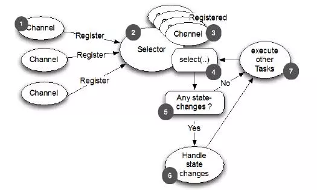

# Netty Learning

Netty is an asynchronous event-driven network application framework
for rapid development of maintainable high performance protocol servers & clients.

Keywords:
- NIO
- event-driven
- framework
- protocol

## Brief introduction
Netty is a NIO (Nonblocking I/O, comparing with BIO, which is blocking I/O) client server framework which enables quick and easy development of network applications such as protocol servers and clients. It greatly simplifies and streamlines network programming such as TCP and UDP socket server.

'Quick and easy' doesn't mean that a resulting application will suffer from a maintainability or a performance issue. Netty has been designed carefully with the experiences earned from the implementation of a lot of protocols such as FTP, SMTP, HTTP, and various binary and text-based legacy protocols. As a result, Netty has succeeded to find a way to achieve ease of development, performance, stability, and flexibility without a compromise.

## Architecture


上面这张图就是在官网首页的架构图，我们从上到下分析一下。

> - 绿色的部分Core核心模块，包括零拷贝、API库、可扩展的事件模型。
> - 橙色部分Protocol Support协议支持，包括Http协议、webSocket、SSL(安全套接字协议)、谷歌Protobuf协议、zlib/gzip压缩与解压缩、Large File Transfer大文件传输等等。
> - 红色的部分Transport Services传输服务，包括Socket、Datagram、Http Tunnel等等。

以上可看出Netty的功能、协议、传输方式都比较全，比较强大。

## Benefits
- 并发高
- 传输快
- 封装好

### 并发高
Netty是一款基于NIO（Nonblocking I/O，非阻塞IO）开发的网络通信框架，对比于BIO（Blocking I/O，阻塞IO），他的并发性能得到了很大提高。

当一个连接建立之后，他有两个步骤要做，第一步是接收完客户端发过来的全部数据，第二步是服务端处理完请求业务之后返回response给客户端。NIO和BIO的区别主要是在第一步。

在BIO中，等待客户端发数据这个过程是阻塞的，这样就造成了一个线程只能处理一个请求的情况，而机器能支持的最大线程数是有限的，这就是为什么BIO不能支持高并发的原因。


而NIO中，当一个Socket建立好之后，Thread并不会阻塞去接受这个Socket，而是将这个请求交给Selector，Selector会不断的去遍历所有的Socket，一旦有一个Socket建立完成，他会通知Thread，然后Thread处理完数据再返回给客户端——这个过程是不阻塞的，这样就能让一个Thread处理更多的请求了。




除了BIO和NIO之外，还有一些其他的IO模型，下面这张图就表示了五种IO模型的处理流程：


- BIO，同步阻塞IO，阻塞整个步骤，如果连接少，他的延迟是最低的，因为一个线程只处理一个连接，适用于少连接且延迟低的场景，比如说数据库连接。
- NIO，同步非阻塞IO，阻塞业务处理但不阻塞数据接收，适用于高并发且处理简单的场景，比如聊天软件。
- 多路复用IO，他的两个步骤处理是分开的，也就是说，一个连接可能他的数据接收是线程a完成的，数据处理是线程b完成的，他比BIO能处理更多请求。
- 信号驱动IO，这种IO模型主要用在嵌入式开发，不参与讨论。
- 异步IO，他的数据请求和数据处理都是异步的，数据请求一次返回一次，适用于长连接的业务场景。

### 传输快
我们知道，Java的内存有堆内存、栈内存和字符串常量池等等，其中堆内存是占用内存空间最大的一块，也是Java对象存放的地方，一般我们的数据如果需要从IO读取到堆内存，中间需要经过Socket缓冲区，也就是说一个数据会被拷贝两次才能到达他的的终点，如果数据量大，就会造成不必要的资源浪费。


Netty针对这种情况，使用了NIO中的另一大特性——零拷贝，当他需要接收数据的时候，他会在堆内存之外开辟一块内存，数据就直接从IO读到了那块内存中去，在netty里面通过ByteBuf可以直接对这些数据进行直接操作，从而加快了传输速度。


### 封装好

## Concepts

### Channel
数据传输流，与channel相关的概念有以下四个，一张图让你了解netty里面的Channel。


- Channel，表示一个连接，可以理解为每一个请求，就是一个Channel。
- ChannelHandler，核心处理业务就在这里，用于处理业务请求。
- ChannelHandlerContext，用于传输业务数据。
- ChannelPipeline，用于保存处理过程需要用到的ChannelHandler和ChannelHandlerContext。

### ByteBuf
ByteBuf是一个存储字节的容器，最大特点就是使用方便，它既有自己的读索引和写索引，方便你对整段字节缓存进行读写，也支持get/set，方便你对其中每一个字节进行读写，他的数据结构如下图所示：


他有三种使用模式：
- Heap Buffer 堆缓冲区: 堆缓冲区是ByteBuf最常用的模式，他将数据存储在堆空间。
- Direct Buffer 直接缓冲区: 直接缓冲区是ByteBuf的另外一种常用模式，他的内存分配都不发生在堆，jdk1.4引入的nio的ByteBuffer类允许jvm通过本地方法调用分配内存，这样做有两个好处
	+ 通过免去中间交换的内存拷贝, 提升IO处理速度; 直接缓冲区的内容可以驻留在垃圾回收扫描的堆区以外。
	+ DirectBuffer 在 -XX:MaxDirectMemorySize=xxM大小限制下, 使用 Heap 之外的内存, GC对此”无能为力”,也就意味着规避了在高负载下频繁的GC过程对应用线程的中断影响.
- Composite Buffer 复合缓冲区: 复合缓冲区相当于多个不同ByteBuf的视图，这是netty提供的，jdk不提供这样的功能。

### Codec
Netty中的编码/解码器，通过他你能完成字节与pojo、pojo与pojo的相互转换，从而达到自定义协议的目的。

在Netty里面最有名的就是HttpRequestDecoder和HttpResponseEncoder了。

## Example
首先搭建一个HelloWord工程，先熟悉一下API，还有为后面的学习做铺垫。以下面这张图为依据：


- 紫色框是thread
- 橙色框是class instance
- 白色框是function

### dependency
使用的版本是4.1.20，相对比较稳定的一个版本。
```
<dependency>
    <groupId>io.netty</groupId>
    <artifactId>netty-all</artifactId>
    <version>4.1.20.Final</version>
</dependency>
```

### 创建服务端启动类
```
public class MyServer {
    public static void main(String[] args) throws Exception {
        //创建两个线程组 boosGroup、workerGroup
        EventLoopGroup bossGroup = new NioEventLoopGroup();
        EventLoopGroup workerGroup = new NioEventLoopGroup();
        try {
            //创建服务端的启动对象，设置参数
            ServerBootstrap bootstrap = new ServerBootstrap();
            //设置两个线程组boosGroup和workerGroup
            bootstrap.group(bossGroup, workerGroup)
                //设置服务端通道实现类型    
                .channel(NioServerSocketChannel.class)
                //设置线程队列得到连接个数    
                .option(ChannelOption.SO_BACKLOG, 128)
                //设置保持活动连接状态    
                .childOption(ChannelOption.SO_KEEPALIVE, true)
                //使用匿名内部类的形式初始化通道对象    
                .childHandler(new ChannelInitializer<SocketChannel>() {
                        @Override
                        protected void initChannel(SocketChannel socketChannel) throws Exception {
                            //给pipeline管道设置处理器
                            socketChannel.pipeline().addLast(new MyServerHandler());
                        }
                    });//给workerGroup的EventLoop对应的管道设置处理器
            System.out.println("java技术爱好者的服务端已经准备就绪...");
            //绑定端口号，启动服务端
            ChannelFuture channelFuture = bootstrap.bind(6666).sync();
            //对关闭通道进行监听
            channelFuture.channel().closeFuture().sync();
        } finally {
            bossGroup.shutdownGracefully();
            workerGroup.shutdownGracefully();
        }
    }
}
```

### 创建服务端处理器
```
/**
 * 自定义的Handler需要继承Netty规定好的HandlerAdapter
 * 才能被Netty框架所关联，有点类似SpringMVC的适配器模式
 **/
public class MyServerHandler extends ChannelInboundHandlerAdapter {

    @Override
    public void channelRead(ChannelHandlerContext ctx, Object msg) throws Exception {
        //获取客户端发送过来的消息
        ByteBuf byteBuf = (ByteBuf) msg;
        System.out.println("收到客户端" + ctx.channel().remoteAddress() + "发送的消息：" + byteBuf.toString(CharsetUtil.UTF_8));
    }

    @Override
    public void channelReadComplete(ChannelHandlerContext ctx) throws Exception {
        //发送消息给客户端
        ctx.writeAndFlush(Unpooled.copiedBuffer("服务端已收到消息，并给你发送一个问号?", CharsetUtil.UTF_8));
    }

    @Override
    public void exceptionCaught(ChannelHandlerContext ctx, Throwable cause) throws Exception {
        //发生异常，关闭通道
        ctx.close();
    }
}
```

### 创建客户端启动类
```
public class MyClient {

    public static void main(String[] args) throws Exception {
        NioEventLoopGroup eventExecutors = new NioEventLoopGroup();
        try {
            //创建bootstrap对象，配置参数
            Bootstrap bootstrap = new Bootstrap();
            //设置线程组
            bootstrap.group(eventExecutors)
                //设置客户端的通道实现类型    
                .channel(NioSocketChannel.class)
                //使用匿名内部类初始化通道
                .handler(new ChannelInitializer<SocketChannel>() {
                        @Override
                        protected void initChannel(SocketChannel ch) throws Exception {
                            //添加客户端通道的处理器
                            ch.pipeline().addLast(new MyClientHandler());
                        }
                    });
            System.out.println("客户端准备就绪，随时可以起飞~");
            //连接服务端
            ChannelFuture channelFuture = bootstrap.connect("127.0.0.1", 6666).sync();
            //对通道关闭进行监听
            channelFuture.channel().closeFuture().sync();
        } finally {
            //关闭线程组
            eventExecutors.shutdownGracefully();
        }
    }
}
```

### 创建客户端处理器
```
public class MyClientHandler extends ChannelInboundHandlerAdapter {

    @Override
    public void channelActive(ChannelHandlerContext ctx) throws Exception {
        //发送消息到服务端
        ctx.writeAndFlush(Unpooled.copiedBuffer("歪比巴卜~茉莉~Are you good~马来西亚~", CharsetUtil.UTF_8));
    }

    @Override
    public void channelRead(ChannelHandlerContext ctx, Object msg) throws Exception {
        //接收服务端发送过来的消息
        ByteBuf byteBuf = (ByteBuf) msg;
        System.out.println("收到服务端" + ctx.channel().remoteAddress() + "的消息：" + byteBuf.toString(CharsetUtil.UTF_8));
    }
}
```

### 初步印象
- server & client
- bootstrap (differenciate server & clien)
- event loop group
- channel (differenciate server & clien)
- channel handler
- task queue: handler can submit long time execution to thread pool

### Other functions
Channel handler context channel can execute tasks in thread pool
- task queue
- scheduled task queue

Bootstrap flow


### Channel
A channel provides a user:
- the current state of the channel (e.g. is it open? is it connected?),
- the configuration parameters of the channel (e.g. receive buffer size),
- the I/O operations that the channel supports (e.g. read, write, connect, and bind), and
- the ChannelPipeline which handles all I/O events and requests associated with the channel.

### Selector
Netty中的Selector也和NIO的Selector是一样的，就是用于监听事件，管理注册到Selector中的channel，实现多路复用器。


### PiPeline与ChannelPipeline
在前面介绍Channel时，我们知道可以在channel中装配ChannelHandler流水线处理器，那一个channel不可能只有一个channelHandler处理器，肯定是有很多的，既然是很多channelHandler在一个流水线工作，肯定是有顺序的。

于是pipeline就出现了，pipeline相当于处理器的容器。初始化channel时，把channelHandler按顺序装在pipeline中，就可以实现按序执行channelHandler了。


在一个Channel中，只有一个ChannelPipeline。该pipeline在Channel被创建的时候创建。ChannelPipeline包含了一个ChannelHander形成的列表，且所有ChannelHandler都会注册到ChannelPipeline中。

### ChannelHandlerContext
在Netty中，Handler处理器是有我们定义的，上面讲过通过集成入站处理器或者出站处理器实现。这时如果我们想在Handler中获取pipeline对象，或者channel对象，怎么获取呢。

于是Netty设计了这个ChannelHandlerContext上下文对象，就可以拿到channel、pipeline等对象，就可以进行读写等操作。


### EventLoopGroup
其中包括了常用的实现类NioEventLoopGroup。OioEventLoopGroup在前面的例子中也有使用过。


从Netty的架构图中，可以知道服务器是需要两个线程组进行配合工作的，而这个线程组的接口就是EventLoopGroup。

每个EventLoopGroup里包括一个或多个EventLoop，每个EventLoop中维护一个Selector实例。

## References
- netty home: https://netty.io/
- netty introduction: https://www.baeldung.com/netty
- netty 入门教程1(introduction): https://www.jianshu.com/p/b9f3f6a16911
- netty 入门教程2(http server): https://www.jianshu.com/p/ed0177a9b2e3
- netty 入门教程3(encode & decode): https://www.jianshu.com/p/fd815bd437cd
- netty 入门教程4(长连接): https://www.jianshu.com/p/9d89b2299ce4
- netty 入门 (example): https://developer.aliyun.com/article/769587