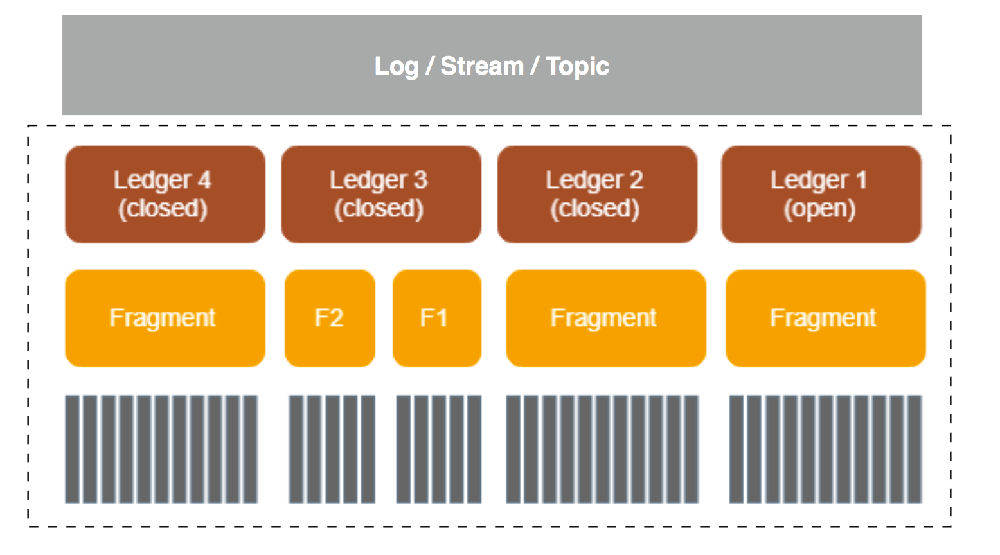
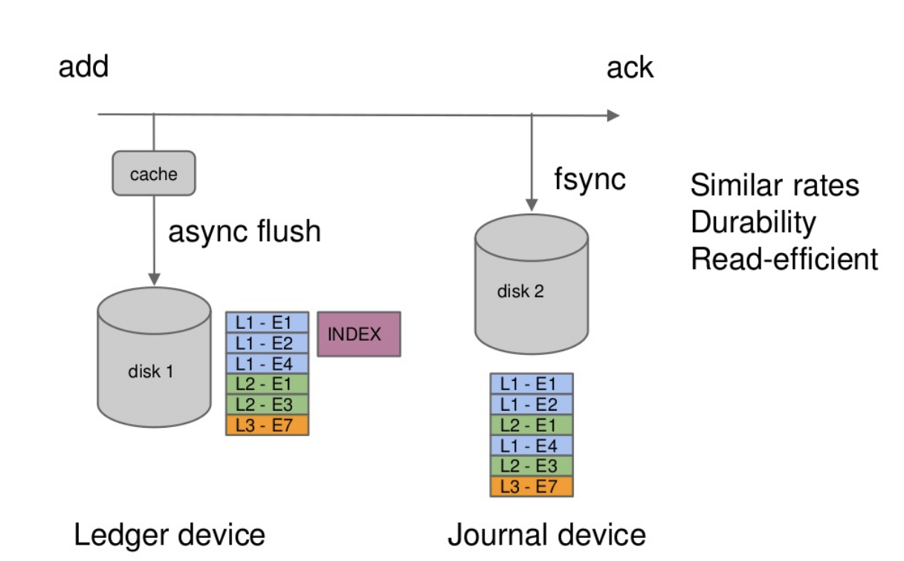
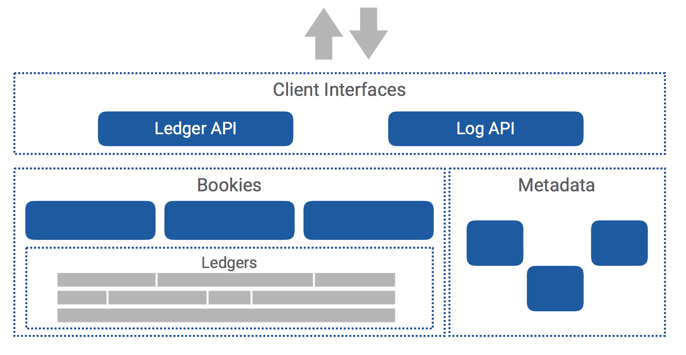

# BookKeeper Learning

A scalable, fault-tolerant, and low-latency storage service optimized for real-time workloads.

BookKeeper is designed to be reliable and resilient to a wide variety of failures. Bookies can crash, corrupt data, or discard data, but as long as there are enough bookies behaving correctly in the ensemble the service as a whole will behave correctly.

## Concepts
- Entry: each unit of a log is an entry (aka record)
- Ledger: streams of log entries are called ledgers
- Bookie: individual servers storing ledgers of entries are called bookies

### Entries
> Entries contain the actual data written to ledgers, along with some important metadata.

BookKeeper entries are sequences of bytes that are written to ledgers. Each entry has the following fields:

| Field | Java type | Description |
| ----- | ----- | ----- |
| Ledger number | `long` | The ID of the ledger to which the entry has been written |
| Entry number | `long` | The unique ID of the entry |
| Last confirmed (LC) | `long` | The ID of the last recorded entry |
| Data | `byte[]` | The entry’s data (written by the client application) |
| Authentication code | `byte[]` | The message auth code, which includes all other fields in the entry |

### Ledgers
> Ledgers are the basic unit of storage in BookKeeper.

Ledgers are sequences of entries, while each entry is a sequence of bytes. Entries are written to a ledger:
- sequentially, and
- at most once.

This means that ledgers have append-only semantics. Entries cannot be modified once they’ve been written to a ledger. Determining the proper write order is the responsibility of client applications.

### Clients and APIs
> BookKeeper clients have two main roles: they create and delete ledgers, and they read entries from and write entries to ledgers.
> 
> BookKeeper provides both a lower-level and a higher-level API for ledger interaction.

There are currently two APIs that can be used for interacting with BookKeeper:
- The [ledger API](https://bookkeeper.apache.org/docs/latest/api/ledger-api/) is a lower-level API that enables you to interact with ledgers directly.
- The [DistributedLog API](https://bookkeeper.apache.org/docs/latest/api/ledger-adv-api/) is a higher-level API that enables you to use BookKeeper without directly interacting with ledgers.

In general, you should choose the API based on how much granular control you need over ledger semantics. The two APIs can also both be used within a single application.

### Bookies
> Bookies are individual BookKeeper servers that handle ledgers (more specifically, fragments of ledgers). Bookies function as part of an ensemble.

A bookie is an individual BookKeeper storage server. Individual bookies store fragments of ledgers, not entire ledgers (for the sake of performance). For any given ledger L, an ensemble is the group of bookies storing the entries in L. *So `ensemble` is target to a specific ledger*

Whenever entries are written to a ledger, those entries are striped across the ensemble (written to a sub-group of bookies rather than to all bookies).

> `striping`: Striping is the process of distributing BookKeeper ledgers to sub-groups of bookies rather than to all bookies in a BookKeeper ensemble. Striping is essential to ensuring fast performance.

#### Motivation
> BookKeeper was initially inspired by the NameNode server in HDFS but its uses now extend far beyond this.

The initial motivation for BookKeeper comes from the Hadoop ecosystem. In the Hadoop Distributed File System (HDFS), a special node called the NameNode logs all operations in a reliable fashion, which ensures that recovery is possible in case of crashes.

The NameNode, however, served only as initial inspiration for BookKeeper. The applications for BookKeeper extend far beyond this and include essentially any application that requires an append-based storage system. BookKeeper provides a number of advantages for such applications:
- Highly efficient writes
- High fault tolerance via replication of messages within ensembles of bookies
- High throughput for write operations via striping (across as many bookies as you wish)

#### Bookie Storage

- Ledger：它是 BK 的一个基本存储单元（本质上还是一种抽象），BK Client 的读写操作也都是以 Ledger 为粒度的；
- Fragment：BK 的最小分布单元（实际上也是物理上的最小存储单元），也是 Ledger 的组成单位，默认情况下一个 Ledger 会对应的一个 Fragment（一个 Ledger 也可能由多个 Fragment 组成）；

关于 Fragment，它是 Ledger 的物理组成单元，也是最小的物理存储单元，在以下两种情况下会创建新的 Fragment：
- 当创建新的 Ledger 时；
- 当前 Fragment 使用的 Bookies 发生写入错误或超时，系统会在剩下的 Bookie 中新建 Fragment，但这时并不会新建 Ledger，因为 Ledger 的创建和关闭是由 Client 控制的，这里只是新建了 Fragment（需要注意的是：**这两个 Fragment 对应的 Ensemble Bookie 已经不一样了**，但它们都属于一个 Ledger，这里并不一定是一个 Ensemble Change 操作）。

### Metadata storage

The BookKeeper metadata store maintains all the metadata of the BookKeeper cluster, such as ledger metadata, available bookies, and so on. Currently, BookKeeper uses ZooKeeper for metadata storage.

### Data management in bookies

Bookies manage data in a [log-structured](https://en.wikipedia.org/wiki/Log-structured_file_system) way, which is implemented using three types of files:
- journals
- entry logs
- index files

#### Journals

A journal file contains BookKeeper transaction logs. Before any update to a ledger takes place, the bookie ensures that a transaction describing the update is written to non-volatile storage. A new journal file is created once the bookie starts or the older journal file reaches the journal file size threshold.

#### Entry logs

An entry log file manages the written entries received from BookKeeper clients. Entries from different ledgers are aggregated and written sequentially, while their offsets are kept as pointers in a ledger cache for fast lookup.

A new entry log file is created once the bookie starts or the older entry log file reaches the entry log size threshold. Old entry log files are removed by the Garbage Collector Thread once they are not associated with any active ledger.

Entry log files are flushed in batches, from the entry logs buffer in memory.

#### Index files

An index file is created for each ledger, which comprises a header and several fixed-length index pages that record the offsets of data stored in entry log files.

Since updating index files would introduce random disk I/O index files are updated lazily by a sync thread running in the background. This ensures speedy performance for updates. Before index pages are persisted to disk, they are gathered in a ledger cache for lookup.

#### Ledger cache (Ledger index cache)

Ledger indexes pages are cached in a memory pool, which allows for more efficient management of disk head scheduling.

#### Adding entries

When a client instructs a bookie to write an entry to a ledger, the entry will go through the following steps to be persisted on disk:
1. The entry is appended to an entry log
2. The index of the entry is updated in the ledger cache
3. A transaction corresponding to this entry update is appended to the journal
4. A response is sent to the BookKeeper client

> For performance reasons, the entry log buffers entries in memory and commits them in batches, while the ledger cache holds index pages in memory and flushes them lazily. This process is described in more detail in the Data flush section below.

#### Data flush
**Ledger index pages** are flushed to index files in the following two cases:
- The ledger cache memory limit is reached. There is no more space available to hold newer index pages. Dirty index pages will be evicted from the ledger cache and persisted to index files.
- A background synchronous thread is responsible for flushing index pages from the ledger cache to index files periodically.

Besides flushing index pages, the sync thread is responsible for rolling **journal files** in case that journal files use too much disk space. The data flush flow in the sync thread is as follows:
1. A `LastLogMark` is recorded in *memory*. The `LastLogMark` indicates that those entries before it have been persisted (to both index and entry log files) and contains two parts:
    - A `txnLogId` (the file ID of a journal)
    - A `txnLogPos` (offset in a journal)
2. Dirty index pages are flushed from the ledger cache to the index file, and entry log files are flushed to ensure that all buffered entries in entry log files are persisted to disk.

> Ideally, a bookie only needs to flush index pages and entry log files that contain entries before `LastLogMark`. There is, however, no such information in the ledger and entry log mapping to journal files. Consequently, the thread flushes the ledger cache and entry log entirely here, and may flush entries after the `LastLogMark`. Flushing more is not a problem, though, just redundant.

3. The `LastLogMark` is persisted to disk (**LastLogMarkFile**), which means that entries added before `LastLogMark` whose entry data and index page were also persisted to disk. It is now time to safely remove journal files created earlier than `txnLogId`.

> If the bookie has crashed before persisting `LastLogMark` to disk, it still has journal files containing entries for which index pages may not have been persisted. Consequently, when this bookie restarts, it inspects journal files to restore those entries and data isn’t lost.

Using the above data flush mechanism, it is safe for the sync thread to skip data flushing when the bookie shuts down. However, in the entry logger it uses a buffered channel to write entries in batches and there might be data buffered in the buffered channel upon a shut down. **The bookie needs to ensure that the entry log flushes its buffered data during shutdown.** Otherwise, entry log files become corrupted with partial entries.

#### Data compaction
On bookies, entries of different ledgers are interleaved in entry log files. A bookie runs a garbage collector thread to delete un-associated entry log files to reclaim disk space. If a given entry log file contains entries from a ledger that has not been deleted, then the entry log file would never be removed and the occupied disk space never reclaimed. In order to avoid such a case, a bookie server compacts entry log files in a garbage collector thread to reclaim disk space.

There are two kinds of compaction running with different frequency: minor compaction and major compaction. The differences between minor compaction and major compaction lies in their threshold value and compaction interval.
- The garbage collection threshold is the size percentage of an entry log file occupied by those undeleted ledgers. The default minor compaction threshold is 0.2, while the major compaction threshold is 0.8.
- The garbage collection interval is how frequently to run the compaction. The default minor compaction interval is 1 hour, while the major compaction threshold is 1 day.

> If either the threshold or interval is set to less than or equal to zero, compaction is disabled.

The data compaction flow in the garbage collector thread is as follows:
- The thread scans entry log files to get their entry log metadata, which records a list of ledgers comprising an entry log and their corresponding percentages.
- With the normal garbage collection flow, once the bookie determines that a ledger has been deleted, the ledger will be removed from the entry log metadata and the size of the entry log reduced.
- If the remaining size of an entry log file reaches a specified threshold, the entries of active ledgers in the entry log will be copied to a new entry log file.
- Once all valid entries have been copied, the old entry log file is deleted.

### ZooKeeper metadata

## Architecture

## References
- homepage: https://bookkeeper.apache.org/
- arch: https://bookkeeper.apache.org/docs/latest/getting-started/concepts/
- introduction: https://www.slideshare.net/MatthieuMorel/building-reliable-systems-with-apache-bookkeeper?next_slideshow=2
- blog: http://matt33.com/2019/01/28/bk-store-realize/