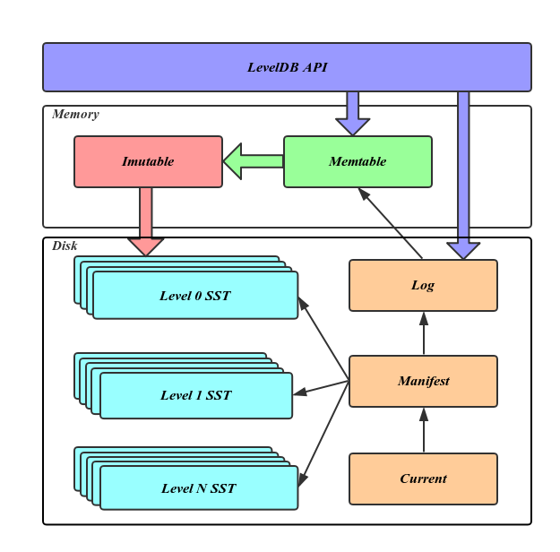
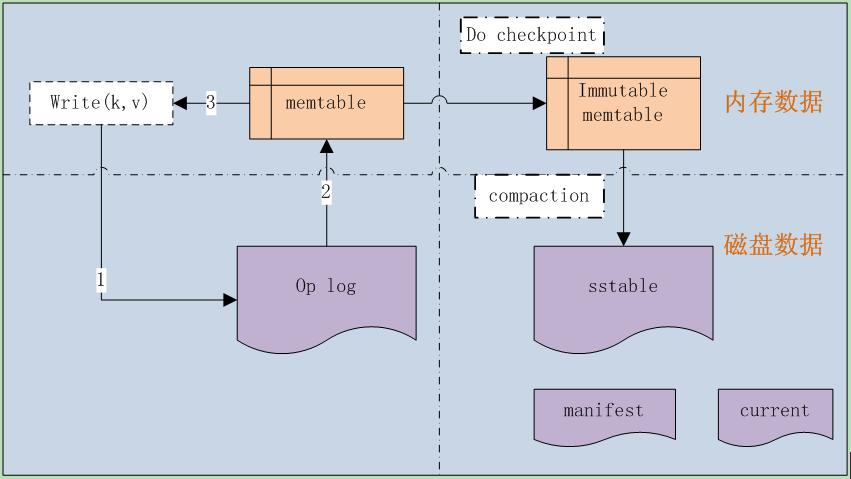

# LevelDB Learning

LevelDB is a key/value store built by Google. It can support an ordered mapping from string keys to string values. The core storage architecture of LevelDB is a log-structured merge tree (LSM), which is a write-optimized B-tree variant. It is optimized for large sequential writes as opposed to small random writes.

- Start year: 2011
- Derived from: Google BigTable

## Terminology

## Design
- Sequential write to disk is 200MB/s, which is much much faster than random write.
- [LSM](lsm) designs for sequential write
- light weight filed-based database like SQLite
- opensource implementation of google BigTable
- atomic operation in one call

### Architecture

Files on disk:
- db的操作日志
- 存储实际数据的 SSTable 文件
- DB的元信息 Manifest 文件
    + manifest 文件记载了所有 SSTable 文件的 key 的范围、level 级别等数据
- 记录当前正在使用的 Manifest 文件，它的内容就是当前的 manifest 文件名
- 系统的运行日志，记录系统的运行信息或者错误日志。
- 临时数据库文件，repair 时临时生成的

### Checkpoints
- When operation logging file exceeds over the limit, it will do checkpoints. Data will be flushed to the disk. And compaction scheme will be called. So data will go down levels. Aside from that, leveldb will generate new logging file and memtable for new use.

### Compression
- record level

### Concurrent Control
- Two-Phase Locking (TPL) to prevent dead lock
- Leveldb only allow one process to open at one time
- Within one process, Leveldb can be accessed by multiple threads
- For multi-writers, it will only allow the first writer to write to database and other writers will be blocked
- For read-write conflicts, readers can retrieve data from immutable which is seperated from writing process, the updated version will come into effect in compaction process

### Data Model
- Key value
- In SSTable the layout of key and value is managed as adjacent string sequence

### Indexes
- It uses skip list in MemTable
- LSM-tree is one type of write-optimized B-tree variants consisting of key-value pairs
- The LSM-tree is a persistent key-value store optimized for insertions and deletions

#### Skip List
- O(logN) for find and insert, slightly slower than red-black tree
- implemented by list
- lock free
- data in order

### Isolation Levels
- Snapshot isolation
- It saves the state of database at a given point and supports reference to it, Users can retrieve data from specific snapshot at the time the snapshot was created

### Joins
- not supported

### Logging
- Logical logging
- Before every insertion, update or delete, system need to add the message to log. In case of node's failure, uncommited messages can be retrieved and do operation again for recovery.

### Storage Architecture
- It puts temporarily accessed data into MemTable and periodically moves data from MemTable into Immutable SSTable
- It adopts compaction to reduce the invalid data in each level and then generates one new block at the next level
- It uses mmap or native read syscall to read SSTable for querying
- The OS caches SSTable for LevelDB
- As LevelDB supports using snappy to compress the value, to avoid uncompress data for each query, it introduces Cache
    + cache holds uncompressed raw data in memory, to avoid the uncompress data process
    + cache is always disabled for batch query, to avoid cache replacement by huge batch

### Storage Model
- SSTable uses NSM (N-ary Storage Model) to arrange data
    + NSM is row-based storage in disk
    + DSM is column-based storage in disk
- It contains a set of arbitrary, sorted key-value pairs
- At the end of the block, it provides the start offset and key value for each block
- Bloom filter can be used to search for target block

### Storage Organization
- log structured

### System Architecture
- In leveldb immutable are stored on the disk which can be shared by different cluster nodes
- There are totally 7 levels plus at most two in-memory tables
- Firstly the system buffers write operations in an in-memory table called MEMTable and flushes data to disk when it becomes full
- On the disk, tables are organized into levels, each level contains multiple tables called SSTable
- The down level maintains larger capacity than the upper level
- When the upper level is full, the system needs to push data to the down level, which might need to read and write multiple SSTables

## Code Analysis
- data structure
    + slice: basic data, length and string
    + status: response status, with error code and message
    + arena: memory pool
    + skip list: kv storage implementation of memtable
    + cache: LRU cache implemented by double linked list
        * LRU cache with mutex lock, make it thread safe
        * sharded LRU cache as wrapper, to partition data and reduce lock cost

## Reference
- https://dbdb.io/db/leveldb
- https://dev.to/zenulabidin/what-is-leveldb-and-how-does-it-work-5ho3
- https://github.com/google/leveldb
- https://blog.csdn.net/sparkliang/article/details/8567602

### Skip List
- https://www.javatpoint.com/skip-list-in-data-structure
- https://zhuanlan.zhihu.com/p/33674267
- https://segmentfault.com/a/1190000018452079