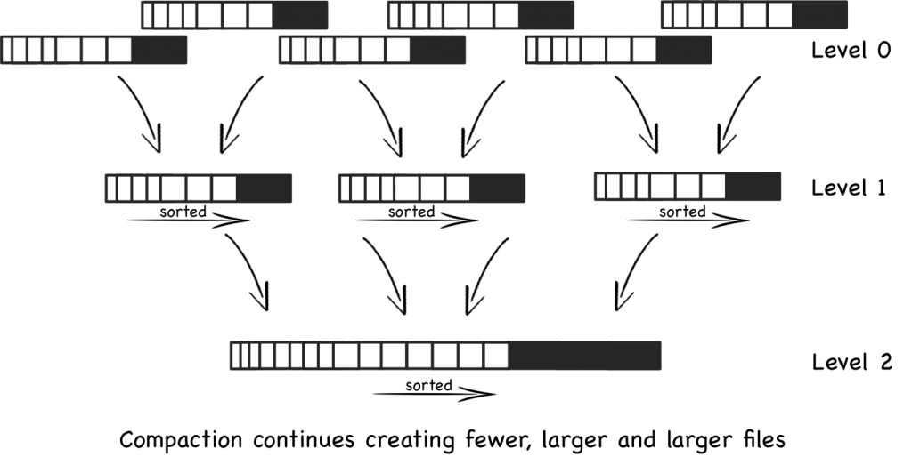

# LSM Learning

LSM is short for log-structured merge tree.

## Basic
- append only, no matter insert/update/delete
- small batch of records write into one file
- each file sorted before write
- immutable file, never updated, new updates go into new files
- reads inspect all files
- periodically files are merged together to keep the number of files down

## Enhancement
- to accelerate key read from files
    + append block-index to the end of files
    + compact small files into big one
    + bloom filter to find key
- levelled compaction to enhance basic compaction
    + each level contain a number of files, no overlap keys in same level (there could be duplicate keys in different level before it merged), except the first level; so search a key in a certain level only need to consult one file
    + higher level contains more keys, can merge lower level files, so overall space is less, IO process is more, which means simple write-oriented workload will not see benefit

## Pros
- sequential write
- sorted files easy to merge
- immutable files, lock free
- benefit for heavy write-oriented workloads

## Cons
- slightly poorer read performance compared to B+ tree
- write amplification

## Reference
- http://www.benstopford.com/2015/02/14/log-structured-merge-trees/
