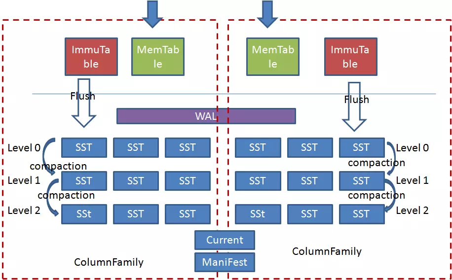

# RocksDB Learning

RocksDB is a storage engine with key/value interface, where keys and values are arbitrary byte streams. It is a C++ library. It was developed at Facebook based on LevelDB and provides backwards-compatible support for LevelDB APIs.

## Terminology

### Column Family

> #### Q: What are column families used for?
> A: The most common reasons of using column families: (1) use different compaction setting, comparators, compression types, merge operators, or compaction filters in different parts of data; (2) drop a column family to delete its data; (3) one column family to store metadata and another one to store the data.

> #### Q: What's the difference between storing data in multiple column family and in multiple rocksdb database?
> A: The main differences will be backup, atomic writes and performance of writes. The advantage of using multiple databases: database is the unit of backup or checkpoint. It's easier to copy a database to another host than a column family. Advantages of using multiple column families: (1) write batches are atomic across multiple column families on one database. You can't achieve this using multiple RocksDB databases. (2) If you issue sync writes to WAL, too many databases may hurt the performance.

> #### Q: I have different key spaces. Should I separate them by prefixes, or use different column families?
> A: If each key space is reasonably large, it's a good idea to put them in different column families. If it can be small, then you should consider to pack multiple key spaces into one column family, to avoid the trouble of maintaining too many column families.

## Design

**优点**
- 顺序写硬盘，append only, 对磁盘和SSD比较友好
- 写操作写完WAL和Memtable就立即返回，写效率非常高
- 由于最终的数据是存储在离散的SST中，SST文件的大小可以根据kv的大小自由配置，            因此很适合做变长存储

**缺点**
- 为了支持批量和事务以及上电恢复操作，WAL是多个CF共享的，导致了WAL的单线程写模式，不能充分发挥高速设备的性能优势（这是相对介质讲，相对B树等其他结构还是有优势）
- 读写操作都需要对Memtable进行互斥访问，在多线程并发写及读写混合的场景下容易形成瓶颈
- 由于Level0层的文件是按照时间顺序刷盘的，而不是根据key的范围做划分，所以导致各个文件之间范围有重叠，再加上文件自上向下的合并，读的时候有可能需要查找level0层的多个文件及其他层的文件，这也造成了很大的读放大。尤其是当纯随机写入后，读几乎是要查询level0层的所有文件，导致了读操作的低效
- 针对第三点问题，Rocksdb中依据level0层文件的个数来做前台写流控及后台合并触发，以此来平衡读写的性能。这又导致了性能抖动及不能发挥高速介质性能的问题
- 合并流程难以控制，容易造成性能抖动及写放大。尤其是写放大问题，在笔者的使用过程中实际测试的写放大经常达到二十倍左右。这是不可接受的，当前我们也没有找到合适的解决办法，只是暂时采用大value分离存储的方式来将写放大尽量控制在小数据

**适用场景**
- 对写性能要求很高，同时有较大内存来缓存SST块以提供快速读的场景
- SSD等对写放大比较敏感以及磁盘等对随机写比较敏感的场景
- 需要变长kv存储的场景
- 小规模元数据的存取

**不适合场景**
- 大value的场景，需要做kv分离
- 大规模数据的存取

## Features & Usage

For the very detailed feature and usage, please reference to [this document](http://alexstocks.github.io/html/rocksdb.html), it introduces much more than the following sections.

### data write
- 一个进程对一个 DB 同时只能创建一个 rocksdb::DB 对象，所有线程共享之。这个对象内部有锁机制保证访问安全，多个线程同时进行 Get/Put/Fetch Iteration 都没有问题，但是如果直接 Iteration 或者 WriteBatch 则需要额外的锁同步机制保护 Iterator 或者 WriteBatch 对象
- 如果需要进行批量的 Get/Put/Delete 操作且需要操作保持原子属性，则可以使用 WriteBatch

### sync & async write
- 默认情况下，RocksDB 的写是异步的：仅仅把数据写进了操作系统的缓存区就返回了，而这些数据被写进磁盘是一个异步的过程
- `write_options.sync = true` 选项可以启用 Posix 系统的 `fsync(...)` or `fdatasync(...)` or `msync(..., MS_SYNC)` 等函数，实现同步写
- 异步写的吞吐率是同步写的一千多倍。异步写的缺点是机器或者操作系统崩溃时可能丢掉最近一批写请求发出的由操作系统缓存的数据，但是 RocksDB 自身崩溃并不会导致数据丢失。而机器或者操作系统崩溃的概率比较低，所以大部分情况下可以认为异步写是安全的
- RocksDB 由于有 WAL 机制保证，所以即使崩溃，其重启后会进行写重放保证数据一致性。如果不在乎数据安全性，可以把 `write_option.disableWAL` 设置为 true，加快写吞吐率 

### Slice & PinnableSlice
- Slice 是 rocksdb 里的 key 和 value 的数据类型
- Slice 自身由一个长度字段 `sizet size` 以及一个指向外部一个内存区域的指针 `const char* data_` 构成，返回 Slice 比返回一个 string 廉价，并不存在内存拷贝的问题
- Slice 自身虽然能够减少内存拷贝，但是在离开相应的 scope 之后，其值就会被释放，rocksdb v5.4.5 版本引入一个 PinnableSlice，其继承自 Slice
- PinnableSlice 如同 Slice 一样可以减少内存拷贝，提高读性能，但是 PinnableSlice 内部有一个引用计数功能，可以实现数据内存的延迟释放，延长相关数据的生命周期

### Transactions
- 当使用 TransactionDB 或者 OptimisticTransactionDB 的时候，可以使用 RocksDB 的 BEGIN/COMMIT/ROLLBACK 等事务 API
- RocksDB 支持活锁或者死等两种事务
- WriteBatch 默认使用了事务，确保批量写成功

- 当打开一个 TransactionDB 的时候，如果 RocksDB 检测到某个 key 已经被别的事务锁住，则 RocksDB 会返回一个 error。如果打开成功，则所有相关 key 都会被 lock 住，直到事务结束。TransactionDB 的并发特性表现要比 OptimisticTransactionDB 好，但是 TransactionDB 的一个小问题就是不管写发生在事务里或者事务外，他都会进行写冲突检测
- OptimisticTransactionDB 提供了一个更轻量的事务实现，它在进行写之前不会进行写冲突检测，当对写操作进行 commit 的时候如果发生了 lock 冲突导致写操作失败，则 RocksDB 会返回一个 error。这种事务使用了活锁策略，适用于读多写少这种写冲突概率比较低的场景下

### Block size
- RocksDB 把相邻的 key 放到同一个 block 中，block 是数据存储和传递的基本单元。默认 Block 的大小是 4096B，数据未经压缩

## Reference
- https://rocksdb.org/docs/getting-started.html
- https://github.com/facebook/rocksdb/wiki
- https://www.jianshu.com/p/73fa1d4e4273
- https://dba.stackexchange.com/questions/166159/what-is-the-point-of-column-families
- http://alexstocks.github.io/html/rocksdb.html
- https://zhuanlan.zhihu.com/p/49966056
- https://www.cnblogs.com/wangzming/p/12969599.html