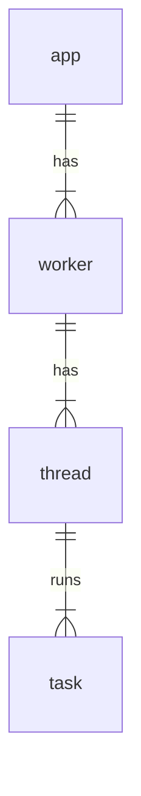

# Apache Samza

A distributed stream processing framework.

Apache Samza is a scalable data processing engine that allows you to process and analyze your data in real-time.

## Concept

- Stream: with partitions
- Stream app: input stream, output stream
- State: stateless & stateful
- Time: processing time & event time
- Process guarantee: at-least once

## Architecture

- Task: logical parallel tasks, map with one partition of a stream
- Container/Worker: physical parallel workers, each runs one or more tasks
- Coordinator: manage task assignment across containers

- Thread: a thread runs one or more tasks, so a partition is processed by one thread
	+ by default, messages in one partition are processed in-order
	+ it can be configured to process out-of-order, for higher throughput
- Checkpoint: incremental checkpoint to flush only the delta state instead of full state
- State storage: local disk state storage by default, can also plug-in remote storage
- Fault tolerance: state change log is streamed as well, failover will consume the subsequent change logs after the state checkpoint
- Host affinity: a task is preferred to be assigned to the same host, for data locality and fast restart or failure recovery

## Reference
- apache samza: https://samza.apache.org/