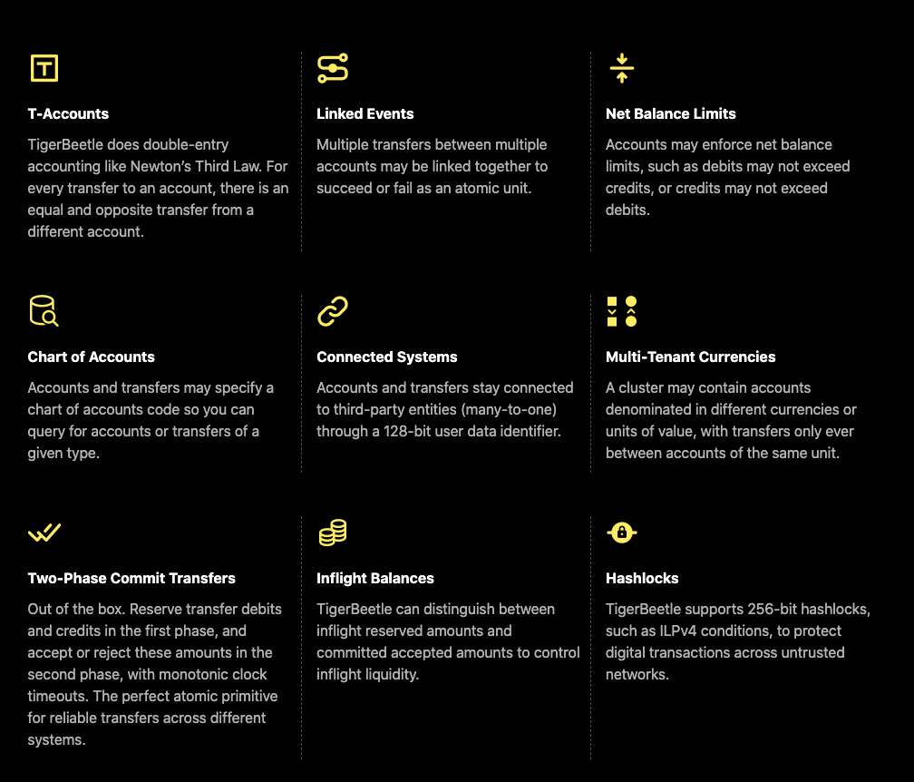

# TigerBeetle

TigerBeetle is a financial accounting database, opensource and fast up to 1M tps.

## Features
- Strict serializability: consensus protocal
- Automated leader election: consensus protocal
- Protocol-aware recovery from corruption and grey failure latency spikes: disk failure tolerance
- No stale reads: read protocal & fast write

## Introductions
- [vedio 1](https://www.youtube.com/watch?v=J1OaBRTV2vs)
- [vedio 2](https://www.youtube.com/watch?v=QOC6PHFPtAM&t=324s)

## Cluster clock

This [document](https://www.tigerbeetle.com/post/three-clocks-are-better-than-one) introduces how does TigerBeetle build its cluster clock, and the cluster clock is very important in its financial accounting scenario, as the ordering basis.

## Tolerance of disk failure

This [vedio](https://www.youtube.com/watch?v=fDY6Wi0GcPs) introduces the Protocol-Aware Recovery for Consensus-Based Storage, to help consensus system to tolerate disk failures.

## References
- official site: https://www.tigerbeetle.com/
- design doc: https://github.com/coilhq/tigerbeetle/blob/main/docs/DESIGN.md
- Marzullo's algorithm: https://en.wikipedia.org/wiki/Marzullo%27s_algorithm
- app tolerate disk failure: https://www.usenix.org/system/files/atc20-rebello.pdf