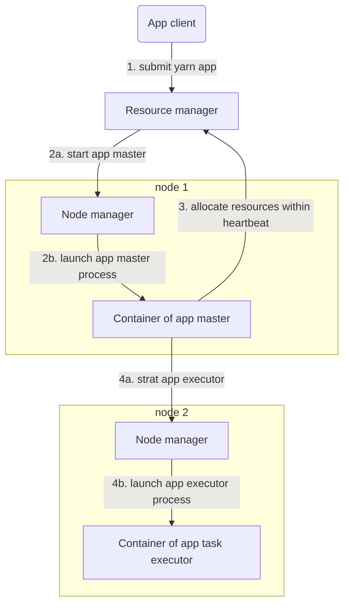

# Yarn

Apache YARN (Yet Another Resource Negotiator) is a resource management system. Firstly used for MapReduce in Hadoop 2, but also used in other systems like Spark, Tez.

## Concept
- resource manager: one per cluster, manage use of resources across cluster
- node manager: on all nodes, launch and monitor containers
- container: executes an application-specific process with a constrained set of resources

## Application lifespan
- one app per user job, like MapReduce
- one app per workflow or session, like Spark
- one app long-running, as coordination role, like Slider

## Scheduling
- FIFO
- Capacity
	+ queue hierarchy
	+ queue elasticity
- Fair
	+ queue hierarchy
	+ FIFO/DRF(dominant resource fairness)

**Delay scheduling**: locality scheduling could be fulfilled by waiting for a short time in practice.

**Dominant resource fairness**: if we need to schedule by multiple kinds of resources, the dominant type percentage would be compared for assignment.

## Failover

### Task failure
task failure could be detected by 
- task executor exit code
- node manager detect task JVM exit
- app master not receive task progress update for long time

then app master can kill and retry failed tasks.

### App master failure
app master failure could be detected by 
- app master error within heartbeat to resource manager
- resource manager detect app master heartbeat timeout

then resource manager can start a new instance of app master running in a new container; in MapReduce, the task state could be recovered by job history

### Node manager failure
node manager failure could be detected by 
- resource manager detect node manager heartbeat timeout

then resource manager can recover impacted app master and tasks to other nodes, and blacklist this node (only for the specific job)

### Resource manager failure
resource manager failure could be detected by 
- backup resource manager watching a zookeeper key

then backup resource manager can step up to be the master, and read the core state stored in zookeeper

